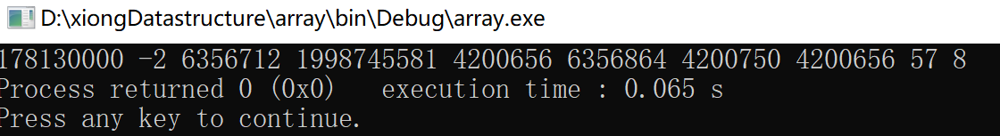

# 数据结构前言

## 编程软件准备：

本pdf编辑软件Typora以及codeblocs 17.12:

```c
链接：https://pan.baidu.com/s/1LXE0sWYVkZTGvIzxWGco2Q 
提取码：a9p3 
复制这段内容后打开百度网盘手机App，操作更方便哦--来自百度网盘超级会员V5的分享
```

直接下载完安装就好了


**typora 使用时ctrl+shift+3可以查看大纲，codeblocks如果有了相应的c语言编辑器，也可不下载**。

c语言编辑器当然也可以选择用clion，到时候用学校的邮箱注册学生账号就好了。编程是基础，需要学会编程实现自己的想法。


## 试题简介

数据结构是计算机人必备的专业课知识，非常重要，随便举一个例子，室友有在作业帮算法岗上班的，算术表达式就是通过树这种数据结构进行存储解析的，另外多项式的合并有用到了线性表。即便是封装了的Java也是会使用相应的集合map，list，set等等，python还有列表等等，所以希望大家引起重视，越到底层的东西越会用到核心专业课的知识。

说一下本试题的用法，本试题分为四部分，涵盖c语言基础，数据结构基础知识，算法题理解以及汇编代码题，数据结构进阶题目等四部分，其中对于跨考人来说，需要先准备c语言基础，希望跨考人c语言能有一定的代码量，可以先去准备c语言，无论是数据结构代码题还是上机考试都会用到，有一定的c语言基础有利于看懂数据结构的代码，将一些简单的算法敲敲实现一下。数据结构基础知识基本上是来自我们的课本上的题目，当然也有一部分是希望大家理解的比如迷宫和算术表达式求值用到的栈的代码，分值越大越是需要重视的部分，这一部分是要求大家都能掌握的，都是书上核心知识点。由于2021年834考察了汇编，所以补充了汇编部分题目，针对汇编的10分一定要拿下。针对学有余力的学弟学妹我最后准备了数据结构进阶题目，帮助大家突破代码难题。

本试题总分756分，详细介绍这四部分：

c语言部分占120分，涵盖c语言各个部分的知识点，除去部分union，enum知识点没给出，其他均已给出，希望大家针对每一部分做一下复习或者预习，这部分**跨考人**需要引起高度重视，希望**跨考人能抽出多于一个星期的时间学一下c语言**，c语言的结构体在下一部分给出，c语言首先要知道数据类型，逻辑算术运算是必不可少的，循环分支基本上是代码不可或缺的内容，如果再没有递归，则没法分析时间复杂度即为O（1）没有分析的必要性，数组和指针是理解顺序存储和链式存储的前提，而且指针是c语言的艺术，最后了解了解字符串即可，但是函数的编写是需要学习的，因为代码题目，往往要求编写相应的函数实现一定的功能，希望这块能够在学习数据结构之前学习。

数据结构基础这一部分占132分，**是本试题的核心**，包含了几种数据结构的应用，**重点是要掌握课本上的各种数据结构的基本操作，要知道基本上题目出自基本操作的基础上，只有掌握了基本操作才能更好地做对题目**，这块的需要大家反复看，希望是暑假之前能够熟练掌握分值较大的部分，基本上除了串栈两块内容是需要了解的，其他还是需要大家能够理解的，图的算法一直说着出的可能性不大，但我认为这块出代码的可能性仅仅低于树和线性表，而且数据结构进阶题目也出在这三部分，此外排序代码中的堆排序已经多次考察，插入排序的链式实现也已经考过，快速排序还没有详细考察这是我认为有可能出代码题的方向，其他的排序也需要了解，整个排序这块必须掌握每趟结果，查找的二分查找要熟练毕竟只有这个查找方法比较特殊。**这一部分132分，虽然分值较少，但却是最重要的。**

算法理解题及汇编题这一部分占据150分，其中算法理解题的要求是不能简简单单会写，而且要看懂代码想表达的意思，这就需要在数据结构基础知识的积累基础上去理解代码，出题人往往不会直接选择常见的数据结构，但是需要选择**常见的功能**，常见的功能就要求在数据结构这一层次去创新，而且代码理解主要集中在线性表这块，因为树和图不好出。那么要想在实现结构创新的话，只能是单链表转变为别的比如双向循环链表。除此之外，在后半部分**，补充了一些汇编的代码和基础知识**，这一部分请大家引起重视，会有一定的概率再考，百度网盘链接分享的**汇编实验代码题**，那个可以作为补充。

数据结构进阶占354分，这部分难度稍大，同时分值也很大，**能够基本满足后期想要刷题的**小伙伴，这部分有来自王道的课后题，也有来自自命题的大学的代码，针对这块希望大家尽量去理解，如果**掌握不了，也没必要太过于纠结**，能出这部分题目已经是很难为相当大部分的人了，所以出这些题目可能就是难就都难，大家不必过于忧虑，其中也是有相当一部分能做出来的题目的，这一块呢，推荐使用时间是暑假，好好利用暑假的时间不要浪费，如果时间不够这一部分简单看看就好了，并不是刷越多的题目越好，不要本末倒置，代码题通常情况下只占15分左右，如果出了多个代码题，那也只能是多个代码填空题，一个代码实现题，而不是多个代码实现题目，因为肯定要考虑做题时间的，而且特别喜欢创新的是计组这块，所以数据结构**不会太难为大家的**。

希望大家能够有所收获，对于c语言和数据结构还有汇编能掌握扎实，能够在代码能力这块上有一些提升。

再难的题目可能就会往算法那块靠，本试题就不再给出了，大家有兴趣可以去相应的刷题网站或者买一本简单的竞赛入门先看着。

# C语言测试题120‘

## 1数据类型以及输入输出

### 填空题 10‘ 

一空一分

```c
int 占__4__字节 取值范围：-2^31~2^31 -1 即为-2147483648 ~ 2147483647
char 占__1__字节 ASCII码  '0':__48___  'A':__65____ 'a':__97____ 
    						取值范围：-2^7~2^7 -1 即为-128 ~ +127 
short 占__2__字节  取值范围：-2^15~2^15 -1 即为 -32768 ~ + 32767
double 占__8__字节  双精度数，IEEE754 包括符号位1位，阶码11位，尾数52位
float  占__4__字节 单精度数，IEEE754 包括符号位1位，阶码8位，尾数23位，IEEE754运算很重要
long 占__8__字节
long long 占__8__字节
unsigned int 无符号整数取值范围 0~2^32-1 即为0 ~ 4294967295 
unsigned short 无符号短整型取值范围 0~2^16-1 即为 0 ~ 65535
bool 占一个比特位
注：float的范围在计组中是个重要的知识点
```

为什么要让大家记住一些数据类型的表示范围，以及一些零碎的知识点，下面我给出一些历年真题：

2014年真题：


选A

2015年真题：


49 D =  31H = 011 0001B 即为 1011 0001B

选D

2017年真题：


其中第六题实际为double类型

5 A  6 B


2018真题：


7 A 8 B


### 补充知识格式控制符

| **格式控制符** | **说明**                                                     |
| -------------- | ------------------------------------------------------------ |
| %c             | 读取一个单一的字符                                           |
| %hd、%d、%ld   | 读取一个十进制整数，并分别赋值给 short、int、long 类型       |
| %ho、%o、%lo   | 读取一个八进制整数（可带前缀也可不带），并分别赋值给 short、int、long 类型 |
| %hx、%x、%lx   | 读取一个十六进制整数（可带前缀也可不带），并分别赋值给 short、int、long 类型 |
| %hu、%u、%lu   | 读取一个无符号整数，并分别赋值给 unsigned short、unsigned int、unsigned long 类型 |
| %f、%lf        | 读取一个十进制形式的小数，并分别赋值给 float、double 类型    |
| %e、%le        | 读取一个指数形式的小数，并分别赋值给 float、double 类型      |
| %g、%lg        | 既可以读取一个十进制形式的小数，也可以读取一个指数形式的小数，并分别赋值给 float、double 类型 |
| %s             | 读取一个字符串（以空白符为结束）                             |

以上是针对**scanf**输入的情况，当然以上的控制格式可以一样用在**printf**输出的时候用

针对**printf**输出格式控制

**printf**() 格式控制符的完整形式如下：

`%[flag][width][.precision]type`

type用上表中的符号

**flag**如下表：

| 标志字符 |                                                              |
| -------- | ------------------------------------------------------------ |
| -        | -表示左对齐。如果没有，就按照默认的对齐方式，默认一般为右对齐。 |
| +        | 用于整数或者小数，表示输出符号（正负号）。如果没有，那么只有负数才会输出符号。 |
| 空格     | 用于整数或者小数，输出值为正时冠以空格，为负时冠以负号       |
| #        | 对于八进制（%o）和十六进制（%x / %X）整数，# 表示在输出时添加前缀；八进制的前缀是 0，十六进制的前缀是 0x / 0X。 |

**width**是一个整数值  **precision**也是一个整数值

例如：%-9d中，d表示以十进制输出，9表示最少占9个字符的宽度，宽度不足以空格补齐，-表示左对齐。综合起来，%-9d表示以十进制输出，左对齐，宽度最小为9个字符。**大家可以亲自试试%9d的输出效果。

%09d 则会在前面补零

%.2lf 保留2位小数

### 程序运行结果题 10’

```c
//4‘
#include <stdio.h>
int main()
{
    short a = -16;
    unsigned short b = a;
    printf("%hu",b);
    return 0;
}
//试给出运行结果，某年有类似计组真题

```

-16表示成制（原码）为 1000 0000 0001 0000 B；

（补码） 1111 1111 1111 0000B  

无符号二进制整数表示成十进制的数为 65520

类似的真题：

2020年真题：


-127 表示成有符号八位二进制（补码）为 1000 0001

 1000 0001的无符号二进制表示为 129

选D

```c
//3’
#include <stdio.h>
int main()
{
    short a = 0x8000;//1000 0000 0000 0000 // 1000 0000
    short b  = a-1;
    printf("%hd\n",a);
    printf("%hd\n",b);
    return 0;
}//试给出运行结果，最好敲一遍运行一下
```

本题主要是想考查溢出

-32768 - 1溢出之后变成最大的短整型整数32767

答案是 32767

运算方法补码运算啊

11  000 0000 0000 0000 0000 0000 0000 0000

11  111 1111 1111 1111 1111 1111 1111 1111

10   111 1111 1111 1111 1111 1111 1111 1111

答案就是32767不过需要指出溢出不指出溢出此题出的意义就没领略

```c
//3‘
#include <stdio.h>
int main()
{
    int a = 1562;
    printf("%d\n",a/3);
    printf("%.2lf\n",a/3.0);
    return 0;
}
//试给出运行结果
```

本题主要是想考查最基础的c语言运算

答案是

520

520.67

520 = int(1562/3) = int(520.67) = 520;

### 程序题 5’

代码一：

```c

//3‘
#include <stdio.h>
#define SIZE 4
int main(){
    int a = 256*256;//十六进制为00010000H
    printf("%hd",(a));
    return 0;
}
//试给出运行结果，并分析结果由来，要结合计组存储方式

```

本题主要是要体会小端存储（很重要的计组知识点）

即为低位存在低地址 高位存在高地址

对于00010000H 低位就是 0000H

&a是a的低地址

%hd 即为输出short型的 也就是输出a低地址的内容 所以答案为0

```c
//真正的小端存储写成如下格式比较明显体现
#include <stdio.h>
#define SIZE 4
int main(){
    int a = 256*256;//十六进制为00010000H
    short *b = ((short*)&a);
    short *c = ((short*)&a+1);
    printf("%hd\n",*b);
    printf("%hd\n",*c);
    return 0;
}
//输出结果为
0//表示低位
1//表示高位
   //正好满足高位存在高地址 低位存在低地址这样写更明显
```


代码二：

```c
//2‘
#include <stdio.h>
int main()
{
    int a = 0x11;//十六进制
    printf("%d",a);
    return 0;
}
//试给出运行结果
```

很简单的题目十六进制转换为十进制

 0x11代表的int型的整数为 1*16+1

答案17

这里给出2进制8进制c语言

```c
#include <iostream>
using namespace std;
int main()
{
    int a = 0b11;//二进制
    int b = 011;//八进制 
    cout<<a<<" "<<b;
    return 0;
}
```


## 2逻辑运算和算术运算 

### 逻辑运算题 9‘

**已知c不为2不为4不为6且c为整数**求出如下四个表达式的真值


A  false B false C false D true

分析一下A：

b==c为假 

a+b>c为真

故为假的

分析一下B ：

假设左边括号为真 则c为3或5，则c%2必为1，

​						则非1为假的

假设左边为假直接为假；

分析一下C：

假设左边括号为真 则c为3或5，则c%2必为1 则右边为假

假设左边假的

分析一下D：

假设左边是正确的那么直接正确

假设左边错误也就是c<2或者c>6右边正确

后续习题

(1)   false 分析：左边a+b>c正确 右边b==c错误故为假的

(2)  true 分析 直接a不为0正确 或后面的都不用看了 直接正确

要想分析的话步骤就是 b+c正确 b-c正确 不为零即为true

先取&&两边运算后取||运算

(3) true

有！先算！，（a>b）错误取非正确 c正确 取非错误两者取&&与

错误，再进行取||后面为1正确

(4) false

x=a 则该式值为3正确取非错误

中间y=b为4正确 相与错误

(5) true

（a+b）正确 取非错误 为0，0+c-1为4正确

b+c/2=6正确两者相与正确

true的值为1 false为0

&& 真值表

| &&   | 0    | 1    |
| ---- | ---- | ---- |
| 0    | 0    | 0    |
| 1    | 0    | 1    |

左边为和上边组合成两个输入

||真值表

|      | 0    | 1    |
| ---- | ---- | ---- |
| 0    | 0    | 1    |
| 1    | 1    | 1    |

左边为和上边组合成两个输入

！真值表

|      | 0    | 1    |
| ---- | ---- | ---- |
| ！   | 1    | 0    |


### 算术运算 5’


12 B 13 B 14 D 15  B 16 A

本部分为c语言基本知识

12表达式取值

x<z?y:z 因为2<4正确所以取y的值为3

13选B

14 11.0/3=3.67，3.67+0.5=4.17 取整为4 如果是11/3则结果为3，3+0.5取整为3

15 1/a=0;注意是整形

16 (int)f=13 对3取余为1

## 3控制语句循环和条件

### 程序运行结果题 19’

代码一

```c
//4'
#include <stdio.h>
int main()
{
    int x=1,y=0,a=0,b=0;
    switch(x)
    {
    case 1:
        switch(y)
        {
        case 0:
            a++;
        case 1:
            b++;
            printf("over\n");
            break;
        }
    case 2:a++;b++;break;
    case 3:a++;b++;
    }
    printf("a=%d,b=%d\n",a,b);
    return 0;
}//给出运行结果
```

运行结果如下：


首先先判断一下x的值进入case1中

然后去判断y的值依次从上到下检索case

检索到case 0则a++

因为没有break则会将下面的case1中内容也顺便执行了

break跳出了分支结构

执行外层的case 2；该语句的break；跳出switch（x）

附例代码：

```c
#include <stdio.h>
int main()
{
    int x=1,y=0,a=0,b=0;
    switch(x)
    {
        case 0: a++; //此处不执行
        case 1: a++; //此处匹配成功
        case 2: a++; //因为上面的语句没有break且匹配成功故此条语句运行
        case 3: a++;//上同
        default:a++;//上同
    }
    printf("a=%d",a);
    return 0;
}
// a=4
```


代码二

```c
//3’
#include <stdio.h>
int main()
{
    int x=0,y=1;
    if(x==0) printf("hello world!\n");
    else if(y==1) printf("hello world!\n");
    else printf("hello world!\n");
    return 0;
}
//给出运行结果，并分析由来
```

只输出了一个hello world!因为if中的语句判断成功了下面的语句else if以及else就不再执行了

代码三

```c
//4'
#include <stdio.h>
int main()
{
    int x=0;
    int n=6;
    while(n--){
    switch(x)
    {
    case 0:
    {
        printf("0:hello world!\n");
        x++;
        break;
    }
    case 1:
    {
        printf("1:hello world!\n");
        x++;
        break;
    }
    case 2:
    {
        printf("2:hello world!\n");
        break;
    }
    default:
        break;
    }
    }
    return 0;
}//给出运行结果
```

运行结果如下：


自行分析一下运行步骤

第一步的时候 n取6 while内循环语句判断为真然后再进行n--此时n为5

接着执行如下代码

第一次 x为0执行case0break；跳出switch

第二步的时候 n取5 while内循环语句判断为真然后再进行n--,n=4

第二次 x为1执行case1后面的语句break跳出switch

第三步的时候 n取4 while内循环语句判断为真然后再进行n--,n=3

第三次 x为2执行case2后面的语句break跳出switch

第四步的时候 n取3 while内循环语句判断为真然后再进行n--,n=2

第四次 x为2执行case2后面的语句break跳出switch

第五步的时候 n取2 while内循环语句判断为真然后再进行n--,n=1

第五次 x为2执行case2后面的语句break跳出switch

第六步的时候 n取1 while内循环语句判断为真然后再进行n--,n=0

第六次 x为2执行case2后面的语句break跳出switch

第七步 n取0 while内循环语句判断为假的结束

代码四

```c
//3'
#include <stdio.h>
int main()
{
    int x,y=0;
    for(x=1;x<=10;x++){
        {if(y>=10)
            break;
            y=y+x;
        }
    }
    printf("%d %d",y,x);
    return 0;
}
//给出运行结果
```

运行结果如下：


for(初始化表达式；循环控制表达式；循环变量增量)
{
循环语句；
}

执行步骤是

（1）第一次进入时 初始化表达式（后续循环不再执行）

（2）判断循环控制表达式

（3）执行循环语句，如果执行break则循环结束

（4）执行循环变量增量

然后重复执行（2）（3）（4）

代码五

```c
//5'
#include <stdio.h>
int main()
{
    int a=3;
    int c=0,b=1;
    if((a>0)||(c=4)) printf("%d\n",c);//c=4不执行
    if((a<0)&&(b=4)) printf("%d\n",b);//b=4也不执行
    printf("%d\n",b);
    if(c=0) printf("c=%d",c);//此处是因为c=0该表达式取值为零则不执行后面的语句
    if(b=1) printf("b=%d",b);
    return 0;
}
//试给出运行结果并分析结果由来

```

运行结果如下：


简单叙述一下运行的过程

首先是第一个if语句判断a>0正确之后后面的

c=4赋值语句就不执行了 本条语句输出0

第二个if语句判断a<0错误之后后面的

b=4就不再执行了 也不输出b

中间的printf打印出来的b并没有被赋值

if(c=0) 会默认为c取得值即为0为假不再执行后面的语句，所以写表达式的时候要注意写两个等号

if(b=1) 会默认为b取得值即为1为b真再执行后面的语句

稍微更改一下最后一个if语句

```c
if(b=3) printf("b=%d",b);//则输出3
```


### 程序理解题目 8‘

代码六

```c
//4‘
#include <stdio.h>
#include <math.h>
bool isPrime(int n){
    for(int i=2;i<=sqrt(n);i++)
        if(n%i==0) return false;
    return true;
}
int main()
{
    int x;
    while(scanf("%d",&x)>0){
        if(isPrime(x))
            printf("%d is a prime number!\n",x);
        else
            printf("%d is a composite number!\n",x);
    }
    return 0;
}
//实现了什么功能
```

实现了多组输入输出以及判断是否为素数

我们判断素数可以从2~n-1

也可以 2~n/2

还可以 2~sqrt（n）

大家感兴趣的可以去网上搜搜各种各样的素数判断方法

代码七

```c
//4’
#include <stdio.h>
int main()
{
    long long number=1;
    int n;
    do{
        scanf("%d",&n);
    }while(n>20||n<0);//只有输入的n是介于0到20之间的才能进行下面的语句
    for(int i=1;i<=n;i++)
        number*=i;
    printf("%lld",number);
    return 0;
}
//实现了什么功能
```

//本题实现了阶乘，也要注意一下do{}while()；用法，我们这里如果不是输入0到20的数字，则会让你重新输入，为什么到20，因为long long型的数字只能允许20的阶乘，超过就溢出了

ps优秀学弟理解：

输入一个0到20的整数(包括0与20),如果不在该范围内，则继续输入，直到输入的值在该范围内。计算它的阶乘并输出

## 4数组和指针部分习题

### 程序运行结果题 11’

代码一：

```c
//3’
#include <stdio.h>
#define SIZE 4
int main(){
   int some_data[SIZE] = {1492,1066};
    int i;
    printf("%2s%14s\n","i","some_data[i]");
    for(i = 0;i < SIZE; i++)
        printf("%2d%14d\n",i,some_data[i]);
    return 0;
}
//试给出运行结果
```

运行结果如下：


后面两个地址的内容初始化为零，前两个初始化为给出的值

我们一般初始化可以写成

```c
int data[size] = {0};
```


代码二：

```c
//3‘
#include <stdio.h>
int main(){
	int a[]={1,2,3},i;
    for(i=0;i<4;i++)
        printf("%4d ",a[i]);
	return 0;
}
//试给出运行结果并分析代码写的不恰当的地方，本题目需要编译器运行，答案不唯一
```

运行结果如下 其中第四个数答案不唯一，


出这个题目的原因是因为，数组的界限一定要搞明白

本题中数组的下标范围为0~2

至于这个题目有同学会疑问为什么是3是因为此3来自i

然后至于为什么来自i，这个要看编译器存储的方式和位置

代码三：

```c
//2’
#include <stdio.h>
int main(){
    int a[10];
    for(int i=0;i<10;i++)
        printf("%d ",a[i]);
    return 0;
}
//试给出运行结果，知道初始化的重要性，本题目需要编译器运行，答案不唯一，不初始化，会读出脏数据
```

运行结果如下：



也就是初始化的值是随机的值，需要我们人为的去进行初始化

，这也是初始化的重要性，在我们的机试当中，尤其重要。

代码四：

```c
//3‘
#include <stdio.h>
#define SIZE 4
int main(){
    short dates[SIZE];
    if(dates+2==&dates[2]) printf("true\n");
    if(*(dates+2)==dates[2]) printf("true\n");
    return 0;
}
//试给出运行结果
```

运行结果


希望大家能理解指针的指向地址以及内容的等价关系

dates代表的数组的首地址

dates+2呢代表指向第三个元素

&dates[2]代表我们取这个数组的第三个元素的地址

### 判断题 7’

代码一：

```c
//1’
int some_data[4] = {1,2,3,4,5}; //true or false ( )
```

超出界限 故错误

代码二：

```c
//3‘
#include <stdio.h>
#define SIZE 5
int main(){
    int oxen[SIZE] = {5,3,2,8};
    int yaks[SIZE];
    yaks = oxen; //不可以这样用 我们数组名所代表的指针其实是不能修改的，错误
    yaks[SIZE] = oxen[SIZE];//错误超出界限
    yaks[SIZE] = {4,5,6,7};//只准在定义变量时这样使用故此处错误
    return 0;
}
//请指出错误的个数 答案三个
```

代码三：

```c
//3‘
float a1[5*2+1]; //true
float a2[sizeof(int)+1];//true
float a3[-4];//false
float a4[0];//true 这个地方可以编译通过的注意一下
float a5[2.5];//false
float a6[(int)2.5];//true
//六行对应六个判断
```

本题主要考察一点我们的数组下标是整数且是大于等于零的整数

### 程序题19'

有如下代码一：

```c
//4'
#include <stdio.h>
int main(void){
    const int days[] = {31,28,31,30,31,30,31,31,30,31,30,31};
    unsigned int index;
    for(index = 0;index < sizeof(days)/sizeof(days[0]);index++)
        printf("Month %2d has %d days.\n",index+1,days[index]);
    return 0;
}
//给出sizeof(days)的值以及sizeof(days[0])的值，有条件可以执行一下
```

sizeof(days) = 48

这个地方sizeof(days)意思是求这个数组所占的字节数

因为每一个int占四个字节，12个int数据也就是48

sizeof(days[0]) = 4 这里就是一个int（days[0]是一个int型）所占的字节数

const 修饰的变量不能修改

代码二：

```c
//3'
#include <stdio.h>
#define SIZE 4
int main(){
    short dates[SIZE];
    short *pti;
    short index;
    double bills[SIZE];
    double *ptf;
    pti = dates;
    ptf = bills;
    printf("%23s %10s\n","short","double");
    for(index = 0;index <SIZE; index ++)
        printf("pointers + %d:%10p %10p\n",index,pti+index,ptf+index);
    return 0;
}
//运行并分析每行相差大小
```

输出的结果实质上是每个存储单元的地址但是short每次增加两个单位因为short占两个字节，double每次增加8个单位因为double占8个字节，同时注意地址是占4字节的


代码三：(上述代码一的另一种写法)

```c
//2'
#include <stdio.h>
int main(void){
    const int days[] = {31,28,31,30,31,30,31,31,30,31,30,31};
    unsigned int index;
    for(index = 0;index < sizeof(days)/sizeof(days[0]);index++)
        printf("Month %2d has %d days.\n",index+1,*(days+index));
    return 0;
}
//这个题目的意思就是想让大家明白我这个数组也可以用指针这样表示 即为 *(days+index) == days[index];两者等价
```

代码四：

```c
//6'
#include <stdio.h>
int main()
{
    int zippo[4][2] = {{2,4},{6,8},{1,3},{5,7}};
    int (*pz)[2];//等同于二维指针 int**pz,不过此处的指针指向的是每行有两个元素的二维数组
    pz = zippo;
    printf("pz = %p, pz + 1 = %p\n",pz,pz+1);
    printf("pz[0]=%p,pz[0] + 1=%p\n",pz[0],pz[0]+1);
    printf(" *pz = %p,  *pz + 1= %p\n",*pz,*pz+1);
    printf("pz[0][0] = %d\n",pz[0][0]);
    printf("  *pz[0] = %d\n",*pz[0]);
    printf("    **pz = %d\n",**pz);
    printf("      pz[2][1] = %d \n",pz[2][1]);
    printf("*(*(pz+2)+1) = %d\n",*(*(pz+2)+1)); //这里要搞懂
    int *p[2];//指针数组
    p[0] = zippo[0];
    printf("%d",p[0][0]);
    return 0;
}

//尽可能理解代码，明白其中代表的地址以及内容
```

本题运行结果如下：


首先第一行之所以差了八个单位，因为我们这个pz+1指向了zippo[1]这个地址，而pz指向zippo[0]，两者相差两个int,相差了8个单位

可以这样理解我们的pz，首先是针对我们的行进行操作，其次再对我们的列

```c
*(*(pz+2)+1) 先取第三行下标为2
    再去取第二列
    我们这个*的意义就在于去降维，去取地址中的内容
    二维指针呢 本身就是指向指针的指针 所以要进行两次*运算才能取到值
```


地址的输出答案不唯一

需要注意就是 

```c
*(*(pz+2)+1) == zippo[2][1] //true;
*pz +1 == pz[0]+1 //true
```

尽量理解其中的等价关系

```c
int *p[2];//指针数组这个是定义了一个int型指针的数组 大小为2
 int (*pz)[2];//这个是定义了一个二维指针，指向一个二维数组中每一行大小为2的这样的一个数组
//所以两者从维度上去讲，第一个是一维的 第二个是二维的
```


代码五：

```c
//4'
#include <stdio.h>
int data[2] = {100,200};
int moredata[2] = {300,400};
int main()
{
    int *p1,*p2,*p3;
    p1=p2=data;
    p3 = moredata;
    printf("  *p1 = %d,  *p2 = %d,  *p3 = %d\n",*p1,*p2,*p3);
    printf("*p1++ = %d, *++p2 = %d, (*p3)++ = %d\n",*p1++,*++p2,(*p3)++);
    printf("  *p1 = %d,  *p2 = %d,  *p3 = %d\n",*p1,*p2,*p3);
    return 0;
}
//试给出运行结果
```

运行结果如下：


首先*运算和++的优先级问题

```c
*p1++ 是先取值输出后再进行自加一的操作
*++p2 是先将指针加一让它指向下一个地址的内容200故得出的值为200
(*p3)++ 是将p3指向的地址内容加一 也就是将300加一
```


## 5函数的编写以及字符串函数

### 程序运行结果题 17'

代码一：

```c
//5'
#include <stdio.h>
void swap1(int a,int b){
    int temp = a;
    a = b;
    b = temp;
}
void swap2(int &a,int &b){
    int temp = a;
    a = b;
    b = temp;
}
void swap3(int *a,int *b){
    int temp = *a;
    *a = *b;
    *b = temp;
}
int main()
{
    int a=1,b=3;
    swap1(a,b);
    printf("a = %d, b = %d\n",a,b);
    swap2(a,b);
    printf("a = %d, b = %d\n",a,b);
    swap3(&a,&b);
    printf("a = %d, b = %d\n",a,b);
    return 0;
}
//试给出运行结果，并浅谈原因
```

本题主要是以交换为例子

浅谈一下交换的形参以及实参

第一个函数只是传个形式的值并不实际交换两个值

第二个函数利用是地址，直接对地址的内容进行交换

 &多见于我们的数据结构函数参数里，表示引用，会修改传入的参数值

第三个函数是利用的指针传值，指针所表示的是变量所存在的地址，将该地址的内容进行交换。

所以答案就是：

a = 1, b = 3

a = 3, b = 1

a = 1, b = 3

代码二：

```c
//5'
#include <stdio.h>
void to_binary(unsigned long n);
int main()
{
    unsigned long number;
    printf("Enter an integer (q to quit):\n");
    while(scanf("%ul",&number)==1)
    {
        printf("Binary equivalent:");
        to_binary(number);
        putchar('\n');
        printf("Enter an integer (q to quit): \n");
    }
    printf("Done.\n");
    return 0;
}
void to_binary(unsigned long n){
    int r;
    r = n%2;
    if(n>=2)
        to_binary(n/2);
    putchar('0'+r);
    return ;
}
//试给出几组输入输出，并分析实现了什么功能
```

本体我们实现了一个讲十进制转换为二进制的这样的一个功能，主要是利用递归思想，所以希望学弟学妹们加深对递归的理解，这也是我们栈的应用，先从低位到高位依次压栈

优秀学弟理解：

当输入一个无符号型长整数时，调用to_binary()函数，求出它的二进制数，（long长度为32字节）

代码三：

```c
//7'
#include <iostream>
#include <stdio.h>
#include <string.h>
#include <algorithm>
using namespace std;
void insertString(char *s,char c){//这是我们的插入
    int i=0,j,len;
    for(i=0;s[i]!='\0';i++)
        if(c<s[i]) break;
    for(len=0;s[len]!='\0';len++);//这里不用strlen的原因是因为，想间接告诉你怎么去求解字符串长度
    s[len+1]='\0';//这里可以不加
    for(j=len;j>i;j--)
        *(s+j) = *(s+j-1);
    s[i] = c;
}
int main()
{
    char str[100];
    gets(str);
    char cnum = getchar();
    sort(str,str+strlen(str));//这是我们的排序需要用到#include <algorithm> 
    //且是c++中的用法，因此需要补足c++中的#include<iostream>
    //以及using namespace std;
    insertString(str,cnum);
    puts(str);
    return 0;
}
//试分析完成什么功能，注意本题需要敲到c++中
//#include <string.h>下面的函数要熟悉
/*例如 strlen strcmp strcat等等*/
```

本题实现了字符串的排序，以及字符串插入功能，出这个题的意思是因为我们顺序表的插入与之类似

另外本题用指针描述希望大家加深对指针的印象，如果理解不了可以改为数组描述一样的

此处给出一位优秀学弟的答案：

先输入一个长度小于等于100的字符串和一个字符，使用sort()函数根据ASCII码进行升序排序，之后将cnum插入到其中合适的位置，最后输出运行之后的字符串，长度比输入的字符串长一个字符


# 数据结构基础 132’

## 1补充知识结构体 4’

七种定义方式

**重点掌握第七种**

- [ ] 若struct后面接的是名字，则其为该结构体的名称。
  第一种是最基本的结构体定义，其定义了一个结构体A。

```cpp
struct A //first
{
   int a;
};
struct A aaa;//declare a variable
```

- [ ] 第二种则是在定义了一个结构体B的同时定义了一个结构体B的变量m。


```cpp
struct B //second
{
   int b;
   char name[10];
}m;
m.b = 1;//attention please:direct only use in function
struct B bb = {1,"xiongxue"};//initialize
```

```c
//for example
#include <stdio.h>
struct B //second
{
   int b;
   char name[10];
}m;
struct B bb = {1,"xiongxue"};//initialize
int main()
{
    m.b = 1;//direct use in the main function
    struct B bc;
    return 0;
}

```


- [ ] 第三种结构体定义没有给出该结构体的名称，但是定义了一个该结构体的变量n，也就是说，若是想要在别处定义该结构体的变量是不行的，只有变量n这种在定义结构体的同时定义变量才行。


```cpp

#include <stdio.h>
struct //third
{
    int c;
}n;
int main()
{
    n.c = 1;
    return 0;
}

```

- [ ] 第四种结构体定义在第一种结构定义的基础上加了关键字typedef，此时我们将struct D{int d}看成是一个数据类型，但是因为并没有给出别名，直接用D定义变量是不行的。如D test；，不能直接这样定义变量test。但struct D test；可行。


```cpp
typedef struct D //forth
{
     int d;
};
struct D ddd;
D er;// both are right
两者均可以全局声明，也可以在函数中声明
```

- [ ] 第五种结构体定义在第四种结构体定义的基础上加上了别名x，此时像在第四种结构体定义中说得那样，此时的结构体E有别名x，故可以用x定义E的结构体变量。用E不能直接定义，需要在前面加struct，如struct E test；。 


```cpp
typedef struct E //fifth
{
     int e;
}x;
x shui = {1};
E hu ={1};//both
两者均可以全局声明，也可以在函数中声明
```

- [ ] 第六种结构体定义在第五种的基础上减去了结构体名，但是若是直接使用y来定义该结构体类型的变量也是可以的。如y test；。（常用）


```cpp
typedef struct //sixth
{
     int f;
}y;
y hjk = {1};//y equals vartype not equals variable
可以全局声明，也可以在函数中声明
```

- [ ] 第七种数据结构书中最常用的表示方法


```c
typedef int Elemtype;//seventh
typedef struct LNode{
    Elemtype data;
    struct LNode *next;
}LNode,*LinkList;
LinkList a  ;// *LinkList represent a pointer == LNode *a;
LNode a;
//recommend this way to define struct
可以全局声明，也可以在函数中声明
```

### 补充开辟空间几种表示

```c
int *a = new int[12];
int *b = (int*)malloc(sizeof(int)*10);//
LNode *ll = new LNode;
LNode *l1 = (LNode*)malloc(sizeof(LNode));
int *c = (int*)calloc(10,sizeof(int));
ElemType* newbase =(ElemType*)realloc(L.elem,(L.listsize+INCREMENT)*sizeof(ElemType));
//attention please #inlclude <stdlib.h> for malloc calloc realloc
//new can be only used in c++ so you can add " #include <iostream> "
// and "using namespace std;"
```

关于realloc的详解，realloc

1、realloc() 的参数一必须是经过malloc()等动态分配函数分配的指针

2、realloc() 的参数二一定要比已分配的空间大，不然会发生数据丢失错误

3、realloc() 扩展内存时，如果当前连续内存块足够 realloc 的话，只是将p所指向的空间扩大，并返回p的指针地址。 这个时候 q 和 p 指向的地址是一样的。

4、如果当前连续内存块不够长度，再找一个足够长的地方，分配一块新的内存，q，并将 p指向的内容 copy到 q，返回 q。并将p所指向的内存空间删除。

补充说明3和4：也就是说 realloc 有时候会产生一个新的内存地址有的时候不会。所以在分配完成后，需要对其值进行判断。

当分配不成功时，返回的指针为NULL，如果不区分p和q，统一用p去接收，此时p将重新指向NULL，原来的内存将丢失，产生内存泄露。

### 删除空间的代码

```c
delete p;//c++
free(p);//c 注意本章上传的codeblocks用这个可以编译通过
```

### 代码题 4‘

结合计组当中的存储方式 主要有 对齐方式 以及小端存储

```c
//4'
#include <stdio.h>
#include <stdlib.h>
struct {
    int a;
    char b;
    short c;
}record;
int main()
{
    record.a=256*256+1;
    record.b='0';
    record.c=256;
    printf("The size of this record is %d!\n",sizeof(record));
    printf("The address of record is %p!\n",&record);
    printf("The address of record.a is %p!\n",&record.a);
    printf("The address of record.b is %p!\n",&record.b);
    printf("The address of record.c is %p!\n",&record.c);
    printf("The value is %c!\n",*(&record.b+1));
    printf("The value of 0 represent %c!\n",0);
    printf("The  short value about address %p  memory  is %hd!\n",&record.a,record.a);
    return 0;
}
//尽可能理解代码，与计组相联系，边界存储，小端存储
```


## 2线性表 30‘

### 顺序表10’

以下是顺序表的部分代码。

重点要掌握的是顺序表的插入和删除，还要知道顺序表是一种随机存取的存储结构，我们考试一般直接写成数组，

 2021年5月15日15:49:57 新增合并已经写出

几个统考的题目一定会写。

```c
//8’
#include <stdio.h>
#include <stdlib.h>
typedef int ElemType;
#define MaxSize 50
typedef struct{
    ElemType data[MaxSize];
    int length;
}SqList;
bool ListInsert(SqList &L,int i,ElemType e){
    if(i<1||i>L.length+1)
        return false;
    if(L.length>=MaxSize)
        return false;
    for(int j=L.length;j>=i;j--)
        L.data[j]=L.data[j-1];
    L.data[i-1]=e;
    L.length++;
    return true;
}
bool ListDelete(SqList &L,int i,ElemType &e){
    if(i<1||i>L.length)
        return false;
    e = L.data[i-1];
    for(int j=i-1;j<L.length-1;j++)
        L.data[j]=L.data[j+1];
    L.length--;
    return true;
}
void OutputSqList(SqList L){
    for(int i=0;i<L.length;i++)
        printf("%d ",L.data[i]);
    printf("\n");
}
void ReverseList(SqList &L){
    ElemType temp;
    for(int i=0;i<L.length/2;i++){
        temp = L.data[i];
        L.data[i]=L.data[L.length-i-1];
        L.data[L.length-i-1]=temp;
    }
}
void merge(SqList &L1,SqList &L2,SqList &D){//两个非递减的合并为一个非递减的顺序表
    int i=0,j=0,k=0;
    while(i<L1.length&&j<L2.length){
        if(L1.data[i]<=L2.data[j]) {D.data[k]=L1.data[i];i++;}
        else{ D.data[k]=L2.data[j];j++;}
        k++;
    }
    while(i<L1.length) {D.data[k]=L1.data[i];i++;k++;}
    while(j<L2.length)  { D.data[k]=L2.data[j];j++;k++;}
    D.length = k;
}
int main()
{
    SqList *L = (SqList*)malloc(sizeof(SqList));
    scanf("%d",&L->length);
    for(int i=0;i<L->length;i++)
        scanf("%d",&L->data[i]);
    ListInsert(*L,2,2);
    OutputSqList(*L);
    SqList LL;
    scanf("%d",&LL.length);
    for(int i=0;i<LL.length;i++)
        scanf("%d",&LL.data[i]);
    ListInsert(LL,2,2);
    OutputSqList(LL);
    return 0;
}

```

### 单链表 20‘

要求必须掌握单链表的如下操作，并能进行一些类似集合交并补的操作，还要懂得快慢指针的思想

```c
//20'
#include <stdio.h>
#include <string.h>
#include <stdlib.h>
#include <stack>
#include <iostream>
using namespace std;
typedef int Elemtype;
typedef struct LNode{
    Elemtype data;
    struct LNode *next;
}LNode,*LinkList;
bool InitList(LinkList &L){
    L = (LinkList)malloc(sizeof(LNode));
    if(!L) return false;
    L->next=NULL;
    return true;
}
bool LinkListCreate_Head(LinkList&L){
    if(!InitList(L)) return false;
    int temp;
    scanf("%d",&temp);
    while(temp!=9999){
        LinkList p = (LinkList) malloc(sizeof(LNode));
        p->data = temp;
        p->next = L->next;
        L->next = p;
        scanf("%d",&temp);
    }
    return true;
}
bool LinkListCreate_Tail(LinkList&L){
    int temp;
    if(!InitList(L)) return false;
    LNode* q = L;//LNode LinkList
    scanf("%d",&temp);
    while(temp!=9999){
        LinkList p = (LinkList) malloc(sizeof(LNode));
        p->data = temp;
        q->next = p;
        q = q->next;
        scanf("%d",&temp);
    }
    q->next=NULL;
    return true;
}
LinkList GetElem(LinkList L,int i){
    if(i==0) return L;
    LinkList p = L->next;
    int k = 1;
    while(p&&k<i){
        p=p->next;
        ++k;
    }
    if(!p||k>i) return NULL;
    return p;
}
bool InsertElem(LinkList&L,Elemtype e,int i){
    if(i<1) return false;
    LinkList p = GetElem(L,i-1);
    if(!p) return false;
    LinkList s = (LNode*)malloc(sizeof(LNode));
    s->data = e;
    s->next = p->next;
    p->next = s;
    return true;
}
bool DeleteElem(LinkList &L,LNode &e,int i){
    if(i<1) return false;
    LinkList p = GetElem(L,i-1);
    if(!p||!p->next) return false;
    e = *(p->next);
    p->next=e.next;
    return true;
}
void LinkReverse1(LinkList &L){//基于头插法
    LinkList p = L->next,r;
    L->next = NULL;
    while(p){
        r=p->next;//save next;
        p->next=L->next;
        L->next=p;
        p=r;
    }
}
void LinkReverse2(LinkList L){//
    if(L->next==NULL) return ;//空表的处理
    LinkList p = L->next,r,pre;
    r = p->next;
    p->next = NULL;
    while(r){
        pre=p;
        p=r;
        r=r->next;
        p->next=pre;
    }
    L->next=p;
}
void insertSort(LinkList &L){
    LinkList p = L->next,r;
    L->next=NULL;//待排序链表只有头节点
    while(p){
        LinkList pre = L;
        r = p->next;//
        while(pre->next&&pre->next->data<p->data){
            pre=pre->next;
        }
        p->next=pre->next;
        pre->next=p;
        p=r;//遍历
    }
}
int getLength(LinkList L){
    int cnt = 0;
    LinkList p = L->next;
    while(p){
        p=p->next;
        cnt++;
    }
    return cnt;
}
void OutputLinkList(LinkList L){
    LinkList p = L->next;
    while(p){
        printf("%d ",p->data);
        p=p->next;
    }
    printf("\n");
}
void OutputLinkList_Re(LinkList L){
    LinkList p = L->next;
    stack<Elemtype> out;//因为此处调用了c++的容器
    while(p){
        out.push(p->data);
        p=p->next;
    }
    while(!out.empty()){
        printf("%d ",out.top());
        out.pop();
    }
    printf("\n");
}
void MergeList(LinkList &La,LinkList &Lb,LinkList &Lc){//用尾插法
    if(!InitList(Lc)) return ;
    LinkList pa = La->next,pb = Lb->next,pc=Lc;
    while(pa&&pb){
        if(pa->data<=pb->data){
            pc->next=pa;
            pc=pa;
            pa=pa->next;
        }else{
            pc->next=pb;
            pc=pb;
            pb=pb->next;
        }
    }
    if(pa) pb=pa;
    while(pb){
        pc->next=pb;
        pc=pb;
        pb=pb->next;
    }
    pc->next=NULL;
}
void MergeList1(LinkList &La,LinkList &Lb,LinkList &Lc){
    if(!InitList(Lc)) return ;
    LinkList pa = La->next,pb = Lb->next,r;
    while(pa&&pb){
        if(pa->data<=pb->data){
            r=pa->next;
            pa->next=Lc->next;
            Lc->next=pa;
            pa=r;
        }else{
            r=pb->next;
            pb->next=Lc->next;
            Lc->next=pb;
            pb=r;
        }
    }
    if(pa) pb=pa;
    while(pb){
        r=pb->next;
        pb->next=Lc->next;
        Lc->next=pb;
        pb=r;
    }
}
LNode* FindLoopStart(LNode *head){//判断是否有环并输出环的入口
    LNode *fast=head,*slow=head;
    while(slow!=NULL&&fast->next!=NULL){
        slow = slow->next;
        fast=fast->next->next;
        if(slow==fast) break;
    }
    if(slow==NULL||fast==NULL) return NULL;
    LNode *p1=head,*p2=slow;
    while(p1!=p2){
        p1=p1->next;
        p2=p2->next;
    }
    return p1;
}
LNode* search_kth(LinkList list,int k){//倒数第k个
    LNode *p=list->next,*q=list->next;
    int count = 0;
    while(p!=NULL){
        if(count<k) count++;
        else q=q->next;
        p=p->next;
    }
    if(count<k) return NULL;
    return q;
}
int main()
{
    LinkList La,Lb,Lc;
    LinkListCreate_Head(La);
    insertSort(La);
    LinkListCreate_Head(Lb);
    insertSort(Lb);
    //MergeList(La,Lb,Lc);
    //OutputLinkList(Lc);
    MergeList1(La,Lb,Lc);
    OutputLinkList(Lc);
    //LinkList p = GetElem(L,7);
    //if(p) printf("%d",p->data);
    //LinkReverse1(L);
    //OutputLinkList(L);
    return 0;
}
//阐述每一个函数完成的功能，自行在main函数中编写代码调用相应的函数，尝试补足删除函数，以及按值查找函数

```

## 3栈的应用 12’

### 迷宫4’

```c
//4'
#include <iostream>
#include <stack>
using namespace std;
//variable define
int maze[10][10]
         ={ {1,1,1,0,0,0,1,1,1,1},
            {1,0,1,0,1,0,0,0,0,0},
            {1,0,1,0,1,0,1,1,1,1},
            {1,0,1,0,1,0,1,1,1,1},
            {1,0,1,0,1,0,0,0,0,1},
            {1,0,1,0,1,0,1,1,1,1},
            {1,0,1,0,1,0,1,1,1,1},
            {1,0,0,0,1,1,1,1,1,1},
            {1,1,1,1,1,1,1,1,1,1},
            {1,1,1,1,1,1,1,1,1,1}
          };
int delta[4][2]={{0,1},{1,0},{0,-1},{-1,0}};
bool **isvisited;
struct Point{
    int x;
    int y;
};
stack<Point> path;
//function define
void find_next(Point &a,int b){
    a.x += delta[b][0];
    a.y += delta[b][1];
}
void initial(){
    isvisited = new bool*[10];
    for(int i=0;i<10;i++)
        isvisited[i]=new bool[10];//default as true;
    for(int i=0;i<10;i++)
        for(int j=0;j<10;j++)
            isvisited[i][j]=true;
}
void print(){
    stack<Point> outPath;
    Point p;
    while(!path.empty()){
        outPath.push(path.top());
        path.pop();
    }
    while(!outPath.empty()){
        p = outPath.top();
        cout<<"  ("<<p.x<<","<<p.y<<")";
        outPath.pop();
    }
}
void finishTheMaze(Point &p1,int x,int y){
    int i,j;
    int direaction = 0;
    bool flag=false;
    //cout<<p1.x<<p1.y;
    while(!path.empty()){
        bool popflag=true;
        for(direaction=0;direaction<4;direaction++){
            i = p1.x;
            j = p1.y;
            i+=delta[direaction][0];
            j+=delta[direaction][1];
            if(i<0||i>9||j<0||j>9) //首先判断是否越界
                continue;
            if(maze[i][j]<1&&isvisited[i][j]){
                find_next(p1,direaction);
                path.push(p1);
                isvisited[i][j]=false;
                popflag=false;//如果为true则该点没有找到路径 则需要弹出返回到原来的路径中
                if(i==x&&j==y){
                    flag = true;// if get the destination

                }
                break;//结束本次操作
            }
        }//end for
        if(flag){
            print();
        }
        if(popflag&&!path.empty()){
            path.pop();//弹出
            p1=path.top();//将新的点赋给p1
        }
    }
    if(!flag) cout<<"没有路径!"<<endl;
}
int main(){
    initial();
    Point *p1 = new Point;
    p1->x=1;
    p1->y=1;//初始化起点
    path.push(*p1);//把起点压栈操作
    finishTheMaze(*p1,1,9);//传入终点
}
//简单了解一下这个栈的应用，手动模拟一一下实现过程给出栈的弹入弹出，尽量给出栈的执行过程
```


### 算术表达式求值 8‘

刚开始运算符号栈压入‘#’

重点的逻辑首先需要掌握优先关系，我们主要是通过栈顶运算符的优先关系以及要压入栈顶的运算符的优先级关系

如果栈顶运算符优先级高那么就弹出栈顶运算符号 并弹出操作数栈的栈顶两个数进行运算，运算结果压入操作数栈

栈顶运算符优先级与要压入的运算符号一致，则为括号匹配，直接弹出即可，不进行运算。

直至栈顶运算符号的优先级比要压入的符号优先级要低，才能压人。

左边是栈顶元素，上边是要压入的元素。


```c
//8’
#include<iostream>     //输入的表达式要以'#'结尾，如‘5+6*3/(3-1)#’
#include<cstring>
#include<cstdio>
#include<cctype>
#include<stack>
using namespace std;

stack<char> opter;    //运算符栈
stack<double> opval;  //操作数栈

int getIndex(char theta)   //获取theta所对应的索引
{
	int index = 0;
	switch (theta)
	{
	case '+':
		index = 0;
		break;
	case '-':
		index = 1;
		break;
	case '*':
		index = 2;
		break;
	case '/':
		index = 3;
		break;
	case '(':
		index = 4;
		break;
	case ')':
		index = 5;
		break;
	case '#':
		index = 6;
	default:break;
	}
	return index;
}

char getPriority(char theta1, char theta2)   //获取theta1与theta2之间的优先级
{
	const char priority[][7] =     //算符间的优先级关系
	{
		{ '>','>','<','<','<','>','>' },
		{ '>','>','<','<','<','>','>' },
		{ '>','>','>','>','<','>','>' },
		{ '>','>','>','>','<','>','>' },
		{ '<','<','<','<','<','=','0' },
		{ '>','>','>','>','0','>','>' },
		{ '<','<','<','<','<','0','=' },
	};

	int index1 = getIndex(theta1);
	int index2 = getIndex(theta2);
	return priority[index1][index2];
}

double calculate(double b, char theta, double a)   //计算b theta a
{
	switch (theta)
	{
	case '+':
		return b + a;
	case '-':
		return b - a;
	case '*':
		return b * a;
	case '/':
		return b / a;
	default:
		break;
	}
}

double getAnswer()   //表达式求值
{
	opter.push('#');      //首先将'#'入栈opter
	int counter = 0;      //添加变量counter表示有多少个数字相继入栈，实现多位数的四则运算
	char c = getchar();
	while (c != '#' || opter.top() != '#')   //终止条件
	{
		if (isdigit(c))   //如果c在'0'~'9'之间
		{
			if (counter == 1)   //counter==1表示上一字符也是数字，所以要合并，比如12*12，要算12，而不是单独的1和2
			{
				double t = opval.top();
				opval.pop();
				opval.push(t * 10 + (c - '0'));
				counter = 1;
			}
			else
			{
				opval.push(c - '0');     //将c对应的数值入栈opval
				counter++;
			}
			c = getchar();
		}
		else//重点需要理解的代码
		{
			counter = 0;   //counter置零
			switch (getPriority(opter.top(), c))   //获取运算符栈opter栈顶元素与c之间的优先级，用'>'，'<'，'='表示
			{
			case '<':               //<则将c入栈opter
				opter.push(c);
				c = getchar();
				break;
			case '=':               //=将opter栈顶元素弹出，用于括号的处理
				opter.pop();
				c = getchar();
				break;
			case '>':               //>则计算
				char theta = opter.top();
				opter.pop();
				double a = opval.top();
				opval.pop();
				double b = opval.top();
				opval.pop();
				opval.push(calculate(b, theta, a));
			}
		}
	}
	return opval.top();   //返回opval栈顶元素的值
}

int main()
{
	//freopen("test.txt", "r", stdin);
	int t;     // 需要计算的表达式的个数
	cin >> t;
	getchar();
	while (t--)
	{
		while (!opter.empty())opter.pop();
		while (!opval.empty())opval.pop();
		double ans = getAnswer();
		cout << ans << endl<< endl;
		getchar();
	}
	 0;
}

```

## 4二叉树以及二叉排序树 27‘

### 二叉树15’

二叉树的代码是一定要会的，以下均为基本代码，希望大家在掌握以下代码的基础上，进而实现求解叶子结点数目，求解祖先，求树高等等之类的，希望大家好好掌握这部分内容。还要掌握其中的递归思想。

```c
//15'
#include <iostream>
#include <stdio.h>
#include <queue>
#include <stack>
#include <stdlib.h>
using namespace std;
typedef int ElemType;
typedef struct BiTNode
{
    ElemType data;
    struct BiTNode *lchild,*rchild;
} BiTNode,*BiTree;
int N;
int preorder[31];
int postorder[31];
int inorder[31];
int layoder[31];
void createByInAndPost(BiTree &tree,int pleft,int pright,int ileft,int iright)
{
    if(pright>=pleft)
    {
        int i=0;
        tree=new BiTNode;
        tree->data=postorder[pright];
        for(i=ileft; i<=iright; i++) //在inorder中寻找根 划分左右子树从而确定p和i两数组的界限
            if(inorder[i]==postorder[pright])
                break;
        createByInAndPost(tree->lchild,pleft,pleft+i-ileft-1,ileft,i-1);
        createByInAndPost(tree->rchild,pleft+i-ileft,pright-1,i+1,iright);
        // the difficult point is the division of the array
        // 删掉postorder的最后一个 删掉inorder的中间一个
    }
    else
    {
        tree=NULL;
    }
}
void createByInAndPre(BiTree &tree,int pleft,int pright,int ileft,int iright)
{
    if(pright>=pleft)
    {
        int i=0;
        tree=new BiTNode;
        tree->data=preorder[pleft];
        for(i=ileft; i<=iright; i++) //在inorder中寻找根 划分左右子树从而确定p和i两数组的界限
            if(inorder[i]==preorder[pleft])
                break;
        createByInAndPre(tree->lchild,pleft+1,pleft+i-ileft,ileft,i-1);
        createByInAndPre(tree->rchild,pleft+i-ileft+1,pright,i+1,iright);
        // the difficult point is the division of the array
        // 删掉pretorder的第一个 删掉inorder的中间一个
    }
    else
    {
        tree=NULL;
    }

}
void createByLayAndIn(BiTree &tree,int lleft,int lright,int ileft,int iright){
    if(ileft<=iright){

		int i = lleft, j = ileft;//分别指向level和in中数组的元素
		int flag = 0;

		//寻找根结点，若level中第一个与in中元素匹配的即为根结点
		for (i = lleft; i <= lright; ++i)
		{
			for (j = ileft; j <= iright; ++j)
			{
				if (layoder[i] == inorder[j])
				{
					flag = 1;
					break;
				}
			}

			if (flag == 1)
				break;
		}
        tree = new BiTNode;
		tree->data = layoder[i];
        createByLayAndIn(tree->lchild,lleft+1,lright,ileft,j-1);
        createByLayAndIn(tree->rchild,lleft+1,lright,j+1,iright);

    }else{
        tree=NULL;
    }
}
void InOrder(BiTNode *bitree)
{
    if(!bitree)
        return;
    InOrder(bitree->lchild);
    cout<<bitree->data<<" ";
    InOrder(bitree->rchild);
}
void InOrderNotRe(BiTree T)
{
    stack<BiTree> S;
    BiTree p = T;
    while(p||!S.empty())
    {
        if(p)
        {
            S.push(p);
            p=p->lchild;
        }
        else
        {
            p = S.top();
            S.pop();
            cout<<p->data<<" ";
            p=p->rchild;
        }
    }
    cout<<endl;
}
void PreOrder(BiTNode *bitree)
{
    if(!bitree)
        return;
    cout<<bitree->data<<" ";
    PreOrder(bitree->lchild);
    PreOrder(bitree->rchild);
}
void PreOrderNotRe(BiTree T){
    stack<BiTree> S;
    BiTree p = T;
    while(p||!S.empty()){
        if(p){
            cout<<p->data<<" ";
            S.push(p);
            p = p->lchild;
        }
        else{
            p = S.top();
            S.pop();
            p = p->rchild;
        }
    }
    cout<<endl;
}
void PostOrder(BiTNode *bitree)
{
    if(!bitree)
        return;
    PostOrder(bitree->lchild);
    PostOrder(bitree->rchild);
    cout<<bitree->data<<" ";
}
void PostOrderNotRe(BiTree T){
    stack<BiTree> S;
    BiTree p = T, r = NULL;
    while(p||!S.empty()){
        if(p){
            S.push(p);
            p=p->lchild;
        }
        else{
            p = S.top();
            if(p->rchild&&p->rchild!=r){
                p = p->rchild;
                S.push(p);
                p = p->lchild;
            }
            else{
                S.pop();
                cout<<p->data<<" ";
                r = p;
                p = NULL;
            }
        }
    }
    cout<<endl;
}
void LayerOrder(BiTNode *bitree) //输出层次感
{
    queue<BiTree> Q;
    BiTree p;
    Q.push(bitree);
    BiTNode *temp = new BiTNode;
    Q.push(temp);
    while(!Q.empty())
    {
        p = Q.front();
        Q.pop();
        if(p==temp)
        {
            cout<<endl;
            if(!Q.empty())
                Q.push(temp);
            continue;
        }
        cout<<p->data<<" ";
        if(p->lchild)
            Q.push(p->lchild);
        if(p->rchild)
            Q.push(p->rchild);
    }

}
int main()
{
    cin>>N;
    for(int i=1; i<=N; i++)
        cin>>preorder[i];
    for(int i=1; i<=N; i++)
        cin>>postorder[i];
    for(int i=1; i<=N; i++)
        cin>>inorder[i];
    for(int i=1; i<=N; i++)
        cin>>layoder[i];
    BiTree bitree;
    createByLayAndIn(bitree,1,N,1,N);
    cout<<"先序遍历：";
    PreOrderNotRe(bitree);
    cout<<endl;
    cout<<"中序遍历：";
    InOrder(bitree);
    cout<<endl;
    cout<<"后序遍历：";
    PostOrderNotRe(bitree);
    cout<<endl;
    cout<<"中序遍历：";
    InOrderNotRe(bitree);
    cout<<"层次遍历："<<endl;
    LayerOrder(bitree);
    return 0;
}
/* input
6
1 2 3 4 5 6
3 4 2 6 5 1
3 2 4 1 6 5
1 2 5 3 4 6
*/
//试给出实现哪些功能，并分析一下样例，最好画出树

```

### 二叉排序树10‘

已经补充二叉排序树删除的代码要求会填关键步骤

```c
//10'
#include <iostream>
using namespace std;
typedef int KeyType;
typedef struct BSTNode {
    KeyType key;
    struct BSTNode *lchild, *rchild;
}BSTNode,*BiTree;
int BST_Insert(BiTree &T,KeyType k){
    if(T==NULL){
        T = new BSTNode;
        T->key=k;
        T->lchild=T->rchild=NULL;
        return 1;
    }
    else if(k==T->key)
        return 0;
    else if(k<T->key)
        return BST_Insert(T->lchild,k);
    else
        return BST_Insert(T->rchild,k);
}
BSTNode *BST_Search(BiTree T,KeyType key){
    while(T!=NULL&&key!=T->key){
        if(key<T->key) T=T->lchild;
        else T=T->rchild;
    }
    return T;
}
void Creat_BST(BiTree &T,KeyType str[],int n){
    T=NULL;
    int i=0;
    while (i<n){
        BST_Insert(T,str[i]);
        i++;
    }
}
BiTree SearchParent(BiTree T,KeyType key){
    BiTree pre=NULL;
    while(T!=NULL&&key!=T->key){
        pre=T;
        if(key<T->key) T=T->lchild;
        else T=T->rchild;
    }
    if(T!=NULL) return pre;
    return NULL;
}
void DeleteBST(BiTree&T,KeyType key){
    BiTree p=T,f=NULL,q,s;
    while(p){
        if(p->key==key) break;//find the node then jump
        f = p;
        if(p->key>key) p=p->lchild;
        else p=p->rchild;
    }
    if(!p) return ;
    if(p->lchild&&p->rchild){//left and right exist
        q=p;
        s=p->lchild;
        while(s->rchild){
            q=s;
            s=s->rchild;
        }
        p->key=s->key;
        if(q!=p) q->rchild=s->lchild;
        else q->lchild=s->lchild;
        delete s;
        return ;
    }//find the prior pointer
    /* if(p->lchild&&p->rchild){//left and right exist
        q=p;
        s=p->rchild;
        while(s->lchild){
            q=s;
            s=s->lchild;
        }
        p->key=s->key;
        if(q!=p) q->lchild=s->rchild;
        else q->rchild=s->rchild;
        delete s;
        return ;
    }//find the next pointer
    the code can replace the words if{...}
    */
    else if(!p->rchild){//不存在右孩子 叶子结点只有左孩子
        q=p;p=p->lchild;
    }
    else if(!p->lchild){
        q=p;p=p->rchild;
    }
    if(!f) T=p;//删除是根结点
    else if(q==f->lchild) f->lchild=p;
    else f->rchild=p;
    delete q;
}
void postOrder(BiTree T){
    if(T){
        postOrder(T->lchild);
        postOrder(T->rchild);
        cout<<T->key<<" ";
    }
}
int main() {
    int str[]={40,8,90,15,62,95,12,23,56,32};
    BiTree T;
    Creat_BST(T,str,10);
    DeleteBST(T,90);
    postOrder(T);
    return 0;
}


```

### 哈夫曼树建立代码 2'

这个了解一下就可以了，出的概率不大，喜欢出在应用题里面

```c
typedef struct{
    int weight;
    int parent,lchild,rchild;
}HTNode,*HuffmanTree;
#define MAXInt 10000
void Select(HuffmanTree HT,int n,int &s1,int &s2){//给出实现
    int min1=MAXInt,min2=MAXInt;
    for(int i=1;i<=n;i++)
        if(HT[i].parent==0&&HT[i].weight<min1){
           	s1=i;
            min1=HT[i].weight;
        }
    for(int i=1;i<=n;i++)
        if(HT[i].parent==0&&HT[i].weight<min2){
           	if(i!=s1){
            	s2=i;
            	min2=HT[i].weight;
            }
        }
}
void CreateHuffmanTree(HuffmanTree &HT,int n){
    if(n<=1) return;
    m = 2*n-1;
    HT = new HTNode[m+1];//0 不存储
    for(int i=1;i<=m;i++){
        HT[i].parent=0;
        HT[i].lchild=0;
        HT[i].rchild=0;
    }//初始化操作
    for(int i=1;i<=n;i++)
        cin>>HT[i].weight;
    for(int i=n+1;i<=m;i++)
    {
        Select(HT,i-1,s1,s2);//伪代码就可以，挑选两个最小的权值放到s1和s2中
        HT[s1].parent=i;
        HT[s2].parent=i;
        HT[i].weight = HT[s1].weight+HT[s2].weight;
        HT[i].lchild = s1;
        HT[i].rchild = s2;
    }
}
```

## 5图的代码 14‘

### DFS、BFS以及拓扑排序8‘

图的邻接表存储结构结合了 顺序存储结构和 链式存储结构两种

以下代码实现了拓扑排序和DFS和BFS，在掌握这三种算法的基础上，要求会进行求解连通分量个数，以及判断图是否有环等等。

```c
//8'
#include <iostream>
#include <queue>
#include <stack>
using namespace std;
#define TRUE 1
#define FALSE 0
#define OK 1
#define ERROR 0
#define INFEASIBLE -1
#define OVERFLOW -2
typedef int Status;
#define MVNum 100 //max number of vertex
typedef int VerTexType;
typedef int OtherInfo;
typedef struct ArcNode
{
    int adjvex;
    struct ArcNode *next;
    OtherInfo info;
}ArcNode;
typedef struct VNode{
    VerTexType data;
    ArcNode *firstarc;
}VNode,AdjList[MVNum];
typedef struct
{
    AdjList vertices;
    int vexnum,arcnum;
}ALGraph;
int Locate(ALGraph G,VerTexType v){
    int i;
    for(i=0;i<G.vexnum;i++)
    if(G.vertices[i].data==v){
        return i;
    }
    return -1;
}
Status CreateUDG0(ALGraph &G)//无向图
{
    int i,j,k;
    VerTexType v1,v2;
    //Otherinfo tmp; //权值
    ArcNode *p1,*p2;
    cin>>G.vexnum>>G.arcnum;
    for(i=0;i<G.vexnum;++i)
    {
       cin>>G.vertices[i].data;
       G.vertices[i].firstarc=NULL;
    }
    for(k=0;k<G.arcnum;++k){
        cin>>v1>>v2;
        //cin>>tmp;
        i = Locate(G,v1);
        j = Locate(G,v2);
        p1 = new ArcNode;
        p1->adjvex=j;
        //p1->info=tmp;
        p1->next = G.vertices[i].firstarc;
        G.vertices[i].firstarc=p1;//head insert
        p2 = new ArcNode;
        p2->adjvex=i;
        //p2->info=tmp;
        p2->next = G.vertices[j].firstarc;
        G.vertices[i].firstarc=p2;
    }
    return OK;
}
Status CreateUDG1(ALGraph &G)//有向图
{
    int i,j,k;
    VerTexType v1,v2;
    //Otherinfo tmp; //权值
    ArcNode *p1;
    cin>>G.vexnum>>G.arcnum;
    for(i=0;i<G.vexnum;++i)
    {
       cin>>G.vertices[i].data;
       G.vertices[i].firstarc=NULL;
    }
    for(k=0;k<G.arcnum;++k){
        cin>>v1>>v2;
        //cin>>tmp;
        i = Locate(G,v1);
        j = Locate(G,v2);
        p1 = new ArcNode;
        p1->adjvex=j;
        //p1->info=tmp;
        p1->next = G.vertices[i].firstarc;
        G.vertices[i].firstarc=p1;//head insert
    }
    return OK;
}
bool visited[MVNum];
int FirstAdjVex(ALGraph G,int v){
    if(!G.vertices[v].firstarc) return -1;
    return G.vertices[v].firstarc->adjvex;
}
int NextAdjVex(ALGraph G,int v,int w){
    ArcNode *p;
    for(p=G.vertices[v].firstarc;p;p=p->next){
        if(p->adjvex==w&&p->next)
            return p->next->adjvex;
    }
    return -1;
}
void DFS(ALGraph G,int v){//from the v-th vertex
    cout<<G.vertices[v].data<<" ";
    visited[v]=true;
    for(int w=FirstAdjVex(G,v);w>=0;w=NextAdjVex(G,v,w)){
       if(!visited[w]) DFS(G,w);
    }
}
void DFSTraverse(ALGraph G){
    for(int v=0;v<G.vexnum;++v)
        visited[v]=false;
    for(int v=0;v<G.vexnum;++v){
        if(!visited[v]) DFS(G,v);
    }
    cout<<endl;
}

void BFS(ALGraph G,int v){
    cout<<G.vertices[v].data<<" ";
    visited[v]=true;
    queue<int> Q;
    Q.push(v);
    while(!Q.empty()){
        int u = Q.front();
        Q.pop();
        for(int w=FirstAdjVex(G,u);w>=0;w=NextAdjVex(G,u,w)){
            if(!visited[w])
            {
                cout<<G.vertices[w].data<<" ";
                visited[w]=true;
                Q.push(w);
            }
        }
    }
    cout<<endl;
}
void BFSTraverse(ALGraph G){
    for(int v=0;v<G.vexnum;++v)
        visited[v]=false;
    for(int v=0;v<G.vexnum;++v){
        if(!visited[v]) BFS(G,v);
    }
    cout<<endl;
}


void FindInDegree(ALGraph G,int indegree[]){
    for(int v = 0;v<G.vexnum;v++)
        for(ArcNode* p = G.vertices[v].firstarc;p;p=p->next)
            indegree[p->adjvex]++;
}
Status TopologicalSort(ALGraph G,int topo[]){
    int indegree[G.vexnum]={0};
    ArcNode *p;
    FindInDegree(G,indegree);
    stack<int> S;
    int m=0,i=0,k;
    for(i=0;i<G.vexnum;++i)
        if(!indegree[i]) S.push(i);
    while(!S.empty()){
        i=S.top();
        S.pop();
        topo[m]=i;
        m++;
        p=G.vertices[i].firstarc;
        while(p!=NULL){
            k=p->adjvex;
            --indegree[k];
            if(indegree[k]==0) S.push(k);
            p=p->next;
        }
    }
    if(m<G.vexnum) return ERROR;
    return OK;
}
int main(){
    ALGraph G;
    CreateUDG1(G);
    DFSTraverse(G);
    BFS(G,0);
    int topo[G.vexnum]={0};
    TopologicalSort(G,topo);
    for(int i=0;i<G.vexnum;i++)
        cout<<G.vertices[topo[i]].data<<" ";
}
/*
6 8
1 2 3 4 5 6
1 4
1 3
1 2
3 5
3 2
4 5
6 5
6 4
*/

```

### 最短路径 6’

Dijkstra算法（重点掌握）

艾兹格·迪科斯彻 曾在1972年获得过素有计算机科学界的诺贝尔奖之称的图灵奖。

1 提出“goto有害论”;（这个问题复试曾经问过）

2 提出信号量和PV原语;（这个是操作系统核心）

3 解决了“哲学家聚餐”问题;

4 Dijkstra最短路径算法和[银行家算法](https://baike.baidu.com/item/银行家算法/1679781)的创造者;

5 第一个Algol 60编译器的设计者和实现者;

6 THE操作系统的设计者和开发者;

与D. E. Knuth并称为我们这个时代最伟大的计算机科学家的人。

我国第一个拿到图灵奖的姚期智院士，成就计算理论，包括[伪随机数](https://blog.csdn.net/wiki/伪随机数)生成，密码学与通信复杂度，清华姚班创始人。

当然也要掌握Dijkstra的表格绘制

如下为2016年算法题


floyd（了解）很简单的一个代码，暴力求解代码

```c
//6’
#include <iostream>
using namespace  std;
#define MAXInt 32767
#define MVNum 100
typedef int VerTexType;
typedef int ArcType;
typedef struct {
    VerTexType vexs[MVNum];
    ArcType arcs[MVNum][MVNum];
    int vexnum,arcnum;
}AMGraph;
int LocateG(AMGraph G,VerTexType e){
    int i=0;
    for(i=0;i<G.vexnum;i++)
        if(G.vexs[i]==e) return  i;
    return -1;
}
void createUDGraph(AMGraph &G){
    cin>>G.vexnum>>G.arcnum;
    VerTexType v,w;
    ArcType  weight;
    int a,b;
    for(int i=0;i<G.vexnum;i++)
        cin>>G.vexs[i];
    for(int i=0;i<G.vexnum;i++)
        for(int j=0;j<G.vexnum;j++)
            G.arcs[i][j]=MAXInt;//初始化为无边的状态
    for(int i=0;i<G.arcnum;i++){
        cin>>v>>w>>weight;
        a = LocateG(G,v);
        b = LocateG(G,w);
        if(a<0||b<0) return ;
        G.arcs[a][b]=weight;
        G.arcs[a][b]=weight;
    }
}
void createGraph(AMGraph &G){//创造有向图
    cin>>G.vexnum>>G.arcnum;
    VerTexType v,w;
    ArcType  weight;
    int a,b;
    for(int i=0;i<G.vexnum;i++)
        cin>>G.vexs[i];
    for(int i=0;i<G.vexnum;i++)
        for(int j=0;j<G.vexnum;j++)
            G.arcs[i][j]=MAXInt;//初始化为无边的状态
    for(int i=0;i<G.arcnum;i++){
        cin>>v>>w>>weight;
        a = LocateG(G,v);
        b = LocateG(G,w);
        if(a<0||b<0) return ;
        G.arcs[a][b]=weight;
    }
}
int path[MVNum];//global variable
ArcType D[MVNum];
void ShortestPath_DIJ(AMGraph G,int v0){
    bool S[G.vexnum];
    int v,i,w,n = G.vexnum,min;
    for(v=0;i<n;++v){//初始化
        S[v] = false;
        D[v] = G.arcs[v0][v];
        if(D[v]<MAXInt) path[v] = v0;
        else path[v]=-1;
    }
    S[v0]=true;
    D[v0]= 0;
    for(i=1;i<n;i++)//进行n-1轮的挑选
    {
        min = MAXInt;
        for(w=0;w<n;w++)
            if(!S[w]&&D[w]<min){//每次挑选出最短的边
                v=w;
                min=D[w];
            }
        S[v]=true;
        for(w=0;w<n;w++)//更新信息
            if(!S[w]&&(D[v]+G.arcs[v][w]<D[w])){
                D[w]=D[v]+G.arcs[v][w];
                path[w]=v;
            }
    }
}
int Distance[MVNum][MVNum];
int route[MVNum][MVNum];
void ShortestPath_Floyd(AMGraph G){
    int i,j,k;
    for(i=0;i<G.vexnum;i++)
        for(j=0;j<G.vexnum;j++){
            Distance[i][j]=G.arcs[i][j];
            if(Distance[i][j]<MAXInt) route[i][j]=i;
            else route[i][j]=-1;
        }
    for(k=0;k<G.vexnum;k++)
        for(i=0;i<G.vexnum;i++)
            for(j=0;j<G.vexnum;j++)
                if(Distance[i][k]+Distance[k][j]<Distance[i][j]){
                    Distance[i][j]=Distance[i][k]+Distance[k][j];
                    route[i][j]=route[k][j];
                }
}
int main(){
    AMGraph  G;
    createGraph(G);
    ShortestPath_DIJ(G,0);//求解下标为0的顶点到其他顶点的最短路径
    ShortestPath_Floyd(G);//得到任意两个节点的最短距离
}
```

## 6查找以及排序 26’

### 快速排序10’

如下为快速排序，平均时间复杂度为O（nlogn）空间复杂度为O（n）

要求会模拟并且真正掌握，会求解类似将奇数挪到偶数前面，负数挪到正数前，并写出代码。

并且如下有二分查找代码希望大家掌握,查找代码需要记忆的不多就是只有一个二分查找，所以希望可以引起大家重视。

```c
//10'
#include <iostream>
using namespace std;
typedef int ElemType;
int Partition(ElemType A[],int low,int high){
    ElemType pivot = A[low];
    while(low<high){
        while(low<high&&A[high]>=pivot) --high;
        A[low]=A[high];
        while(low<high&&A[low]<=pivot) ++low;
        A[high]=A[low];
    }
    A[low] = pivot;
    return low;
}

void QuickSort(ElemType A[],int low,int high){
    if(low<high){
        int pivotpos = Partition(A,low,high);
        QuickSort(A,low,pivotpos-1);
        QuickSort(A,pivotpos+1,high);
    }
}
int Binary_Search(ElemType L[],ElemType key,int n){
    int low=0,high=n-1,mid;
    while(low<=high){
        mid = (low+high)/2;
        if(L[mid]==key)
            return mid;
        else if(L[mid]>key)
            high = mid - 1;
        else
            low = mid + 1;
    }
    return -1;
}
int main(){
    int n;
    cin>>n;
    int *A = new int[n];
    for(int i=0;i<n;i++)
        cin>>A[i];
    QuickSort(A,0,n-1);
    /*for(int i=0;i<n;i++)
        cout<<A[i]<<" ";
    cout<<endl;*/
    cout<<"The index about 2 is "<<Binary_Search(A,2,n);
    return 0;
}
//给出函数实现的功能，有条件能力的可以自己输入数据模拟一下实现过程这个我们后续会讲的代码
```

### 堆排序10‘

采用的是顺序存储结构，利用是完全二叉树的逻辑结构，是选择排序的一种

时间复杂度 O(nlogn)，一般会拿来跟选择排序比较，注意选择排序与堆排序在挑出k个最值方面

如果k<5则选择简单选择排序

如果k>=5选择堆排序

同时要注意大的方面，如何调整大根堆，要求会画会模拟

代码也是非常重要的会让大家填空，要真正理解

```c
//10'
#include <stdio.h>
#include <stdlib.h>
#include <iostream>
using namespace std;
typedef int ElemType;
void HeadAdjust(ElemType A[],int k,int len){
    A[0]=A[k];
    for(int i=2*k;i<=len;i*=2){
        if(i<len&&A[i]<A[i+1])
            i++;
        if(A[0]>=A[i]) break;
        else {
            A[k]=A[i];
            k=i;
        }
    }
    A[k]=A[0];
}
void BuildMaxHeap(ElemType A[],int len){
    for(int i=len/2;i>0;i--)
        HeadAdjust(A,i,len);
}
void HeapSort(ElemType A[],int len){
    BuildMaxHeap(A,len);
    for(int i=len;i>1;i--){
        swap(A[1],A[i]);
        HeadAdjust(A,1,i-1);
        for(int j=1;j<=len;j++){//输出每次排序后的结果
            cout<<A[j]<<" ";
        }
        cout<<endl;
    }
}
int main(){
    int A[11] = {0,80,50,65,13,80,36,96,39,79,59};//注意A[0]为哨兵
    HeapSort(A,10);
}

```

### 其他排序6'

如下：

插入排序有如下三种

直接插入排序

```c
void InsertSort(ElemType A[],int n){
    int i,j;
    for(i=2;i<=n;i++)
        if(A[i]<A[i-1]){
            A[0]=A[i];
            for(j=i-1;A[0]<A[j];--j)
                A[j+1]=A[j];
            A[j+1]=A[0];
        }
}
```

折半插入排序

```c
void InsertSort(ElemType A[],int n){
    int i,j,low,high,mid;
    for(i=2;i<=n;i++){
        A[0]=A[i];
        low=1;
        high=i-1;
        while(low<=high){
            mid=(low+high)/2;
            if(A[mid]>A[0]) high=mid-1;
            else low = mid+1;
        }
        for(j=i-1;j>=high+1;--j)
            A[j+1]=A[j];
		A[high+1]=A[0];
    }
        
    
}
```

希尔排序

本代码理解就好，会模拟写出每次排好的数据就行。

```c
void ShellSort(ElemType A[],int n){
    int dk,i,j;
    for(dk=n/2;dk>=1;dk=dk/2)//此处有误 5,3,1 注5/2 = 2
        for(i=dk+1;i<=n;++i)
            if(A[i]<A[i-dk]){
                A[0]=A[i];
                for(j=i-dk;j>0&&A[0]<A[j];j-=dk)
                    A[j+dk]=A[j];
                A[j+dk]=A[0];
            }
}
```

交换排序除了上面的快速排序还剩下冒泡排序

```c
void BubbleSort(SqList &L){
    bool flag= false;
    for (int i = 1; i < L.length; ++i) {
        flag=false;
        for(int j=1;j<L.length-i+1;j++)
            if(L.data[j]>L.data[j+1]){
                swap(L.data[j],L.data[j+1]);
                flag=true;
            }
        if(flag==false) return;
    }
}
```

选择排序除了堆排序还有简单选择排序如下：

```c
void SelectSort(ElemType A[],int n){
    int min;
    for(int i=0;i<n-1;i++){
        min = i;
    	for(int j=i+1;j<n;j++)
            if(A[j]<A[min]) min = j;
        if(min!=i) swap(A[i],A[min]);
    }    
}
```

归并排序需要结合两个顺序表的合并

```c
ElemType *B = (ElemType*)malloc((n+1)*sizeof(ElemType));
void Merge(ElemType A[],int low,int mid,int high){
    for(int k=low;k<=high;k++)
        B[k]=A[k];
    for(i=low;j=mid+1,k=i;i<mid&&j<=high;k++){
        if(B[i]<=B[j])//两段进行比较合并
            A[k]=B[i++];
        else
            A[k]=B[j++];
    }
    //解决剩下的没有比较的
    while(i<=mid) A[k++]=B[i++];
    while(j<=high) A[k++]=B[j++];
}
void MergeSort(ElemType A[],int low,int high){
    if(low<high){
        int mid=(low+mid)/2;
        MergeSort(A,low,mid);
        MergeSort(A,mid+1,high);//先分解
        Merge(A,low,mid,high);//最后归并
    }   
}
```

## 7串 6‘

为了查缺补漏，特地将模式匹配的代码给出，对于串的模式匹配 做简单了解 要会模拟

防止出题人的出其不意。

```c
#define MAXLEN 25
typedef struct{
    char ch[MAXLEN+1];
    int length;
}SString;
//BF
int Index_BF(SString S,SString T,int pos){
    int i=pos,j=1;
    while(i<S.length && j<=T.length){
        if(S.ch[i]==T.ch[j]) {++i;++j;}
        else {i=i-j+2;j=1;}
    }
    if(j>T.length) return i-T.length;
    else return 0;
} 
//KMP
int Index_KMP(SString S,SString T,int pos){
    int i=pos,j=1;
    while(i<S.length && j<=T.length){
    	if(j==0||S.ch[i]==T.ch[j]) {++i;++j;}
        else j=next[j];
    }
    if(j>T.length) return i-T.length;
    else return 0;
}
void get_next(SString T,int next[]){
    int i=1;
    next[1]=0;
    int j=0;
    while(i<T.length){
        if(j==0||T.ch[i]==T.ch[j]) {++i;++j;next[i]=j;}
        else j=next[j];
    }
}
void get_nextval(SString T,int nextval[]){
    int i=1,j=0;
    nextval[1]=0;
    while(i<T.length){
        if(j==0||T.ch[i]==T.ch[j]) {
            ++i;++j;
            if(T[i]!=T[j]) nextval[i]=j;
        	else	nextval[i]=nextval[j];
        }
        else j=nextval[j];
    }    
       
}
```

## 8附加题 13’

### 附加题一8’

本附加题可在你学习完成浮点数运算加减再行查看（本题系2019年计组真题）

```c
//8'
#include <stdio.h>
int main(){
    int i=123456789;
    float f = 123456789.0f;
    f+=20;
    printf("1:%f\n",f);
    f=(float)i;
    printf("2:%f\n",f);
    float f1=0.33f,f2=0.11f;
    f2+=0.22f;
    if(f1 == f2)
        printf("3: Equal\n");
    else
        printf("3: Not Equal\n");
    return 0;
}
//请求给出结果并分析原
```

运行结果如下：


答案分析如下：


### 附加题二5‘

关于浮点数存储的理解，以及小端存储

见如下代码（此题必备知识小端存储+IEEE754单精度浮点数存储）

```c
//5'
#include <stdio.h>
#include <stdlib.h>
int main(){
    float a=-(171.0/256.0);
    char *b = ((char*)&a);
    char *c = ((char*)&a+1);
    char *d = ((char*)&a+2);
    char *e = ((char*)&a+3);
    printf("the size of short is %d\n",sizeof(short));
    printf("%hd\n",*b);
    printf("%hd\n",*c);
    printf("%hd\n",*d);
    printf("%hd\n",*e);
    return 0;
}//请给出结果并分析结果原因
```

给提示

-(171.0/256.0)表示为

对应的是小端存储结果如下:


*10111111*    **00101011**  *00000000*    ***00000000***

一共四个部分，每个部分一个字节，依次第一二三四部分

首先是b指向的地址是a的首地址，也就是低低地址，低地址存储低位

也就是后面的八个 0000 0000 即0 （对应第四部分部分）

c指向的是a的首地址的下一个地址，也就是0000 0000 即0（对应第三部分斜体）

d指向也就是a的首地址偏移两个地址，也就是第二部分

0000 0000 0010 1011 = 32+8+2+1 = 43

e指向也就是第一部分 1011 1111

因为char指向的是一个字节，而输出的时候是按照short输出，这个时候牵涉到符号位的扩展，如果是正数，高字节会被扩展成0，如果是负数，则会全部扩展成1。但扩展对于原来的真值并没有改变。

 1011 1111对应的数为 -65

# 算法理解题及汇编题目150‘

## 线性表部分 45’

### 1 顺序表题目15'

(1)指出代码功能15'

```c
#define MaxSize 50
typedef struct{
    ElemType data[MaxSize];
    int length;
}SqList;
//已知LA和LB递增有序
void unknown1(SqList LA,SqList LB,SqList LC){
    int i=0,j=0,k=0;
    while(i<LA.length&&j<LB.length){
        if(LA.data[i]<LB.data[j]){
                LC.data[k++]=LA.data[i++];
        }
        else if(LA.data[i]>LB.data[j]){
                LC.data[k++]=LA.data[j++];
        }
        else{
             	LC.data[k++]=LA.data[i++];
            	j++;
        }
    }
    while(i<LA.length){
        if(LC.data[k-1]!=LA.data[i])
            	LC.data[k++]=LA.data[i++];
            else
                i++;
    }
    while(j<LB.length){
        if(LC.data[k-1]!=LB.data[j])
            LC.data[k++]=LB.data[j++];
         else
            j++;
    }
}
void unknown2(SqList LA,SqList LB,SqList LC){
    int i=0,j=0,k=0;
    while(i<LA.length&&j<LB.length){
        if(LA.data[i]<LB.data[j]){
            i++;
        }
        else if(LA.data[i]>LB.data[j]){
           	j++;
        }
        else{
            LC.data[k++] = LA.data[i++];
            j++;
        }
    }
}
void unknown3(SqList LA,SqList LB,SqList LC){
    int i=0,j=0,k=0;
    while(i<LA.length&&j<LB.length){
        if(LA.data[i]==LB.data[j]){
            i++;
            j++;
        }else if(LA.data[i]>LB.data[j]){
            j++;
        }else{
            LC.data[k++]=LA.data[i++];
        }     
    } 
    while(i<LA.length){
        if(LC.data[k-1]!=LA.data[i])
            	LC.data[k++]=LA.data[i++];
            else
                i++;
    }
}
//指出三个函数的功能
```

其中unknown1实现LA和LB并集求解以递增序列结果放到LC中

unknown2实现LA和LB的交集求解以递增序列结果放到LC中

unknown3实现LA-LB并将以递增序列结果放到LC中

### 2 链表题目 30'

（1）题目分值五分 6‘

```c
typedef struct LNode
{
    int data;
    struct LNode * next;
}LNode,*LinkList;
void unknown(LinkList &L){
    LinkList r,p = L;
    L=NULL;
    while(p){
        r = p->next;
        p->next = L;
        L = p;
        p = r;
    }
}//指出函数功能
```

以上代码完成了不带头结点的单链表逆置，注意与头结点逆置的区别。

答出逆置可得四分，答出不带头结点的单链表逆置可得满分。

（2）题目分值五分 17’ (2021年833真题)

```c
typedef struct Node
{
    int data;
    struct Node * prior;
    struct Node * next;
}LinkNode,*LinkList;
void unknown(LinkList L){
    p = L->next;
    q=p->next;
    r=q->next;
    while(q!=L){
        while(p!=L&&p->data>q->data) p = p->prior;
        q->prior->next=r;
        (1)_r->prior=q->prior__;//修改前驱 不修改前驱指向q
        q->next=p->next;
        q->prior=p;
        (2)___p->next->prior=q____;
        (3)___p->next=q_____________;
        q=r;
        p=q->prior;//p指向队尾
        (4)____r=q->next____________;
    }
}
```

以上代码很容易看出来是排序功能，描述要尽可能准确。

可以这样表述：完成了一个循环双向链表按数据域从小到大排序的功能。

尽可能表述清楚数据结构类型，排序也不要说的很笼统可以说一下

从小到大还是从大到小。

(3)指出代码功能 7'

```c
typedef struct LNode
{
    int data;
    struct LNode * next;
}LNode,*LinkList;
//该链表不带头结点
void unknown(LinkList &L,int n){
    LinkList p = L;
    while(p->next){
       p=p->next; 
    }
    p->next = L;
    while(n--){
        L=L->next;
        p=p->next;
    }
    p->next=NULL;
}
```

完成了一个左移n位的操作。

## 树部分 25’

### 1 二叉树题目 15'

(1)关于树的理解代码 10‘

```c
typedef struct BiTNode{
    ElemType data;
    struct BiTNode *lchild,*rchild;
} BiTNode,*BiTree;
void unknown(BiTree T,ElemType x){
    stack<BiTree> S;
    BiTree p = T, r = NULL;
    while(p||!S.empty()){
        if(p){
            S.push(p);
            p=p->lchild;
        }
        else{
            p = S.top();
            if(p->rchild&&p->rchild!=r){
                p = p->rchild;
                S.push(p);
                p = p->lchild;
            }
            else{
                S.pop();
                if(p->data==x) break;
                r = p;
                p = NULL;
            }
        }
    }
    while(!S.empty()){
        cout<<S.top<<" ";
        S.pop();
    }
}
//代码功能
```

查找了数据域为x的祖先并输出

(2)关于树的递归以及性质 5’

```c
int unknown(BiTree T){
    if(!T) return 0;
    else if(T->lchild==NULL&&T->rchild==NULL)
        return 1;
    return unknown(T->lchild)+unknown(T->rchild)-1;
}
```

相信有很多人都会回答出该功能返回的是叶子数减一，可以给4‘

其实你还可以更进一步，因为二叉树的性质n0 = n2+1

所以这个实际上是求解度为2的分支节点个数的，只不过换一种方式，答出此点可给满分。

### 2 二叉排序树题目 5‘

（1）指出下列代码作用 5'

```c
typedef struct BSTNode {
    KeyType key;
    struct BSTNode *lchild, *rchild;
}BSTNode,*BiTree;
void unknown(BiTree T){
    if(!T) return;
    unknown(T->rchild);
    cout<<T->key<<" ";
    unknown(T->lchild);
}
```

很简单 得到一个逆序的序列，注意如上代码是先访问右子树，再根，再左，正好跟中序遍历相反，所以得到是一个逆序序列结果。

### 3森林题目 5‘

（1）代码理解

```c
typedef struct CSNode {
    ElemType data;
    struct CSNode *firstchild, *nextsibling;
}CSNode,*CSTree;//孩子兄弟表示法表示的森林
int unknown(CSTree t){
    if(!t) return 0;
    else if(!t->firstchild) return 1+unknown(t->nextsibling);
    else return unknown(t->firstchild+t->nextsibling);
}
```

求解森林中的叶子结点的个数

## 图部分 10‘

(1)关于图代码理解问题一 5’

```c
//已知G为无向图
void unknown1(ALGraph G,int v){
    visited[v]=true;
    for(int w=FirstAdjVex(G,v);w>=0;w=NextAdjVex(G,v,w)){
       if(!visited[w]) unknown1(G,w);
    }
}
int unkonown2(ALGraph G){
    int count = 0;
    for(int v=0;v<G.vexnum;++v)
        visited[v]=false;                           
    for(int v=0;v<G.vexnum;++v){
        if(!visited[v]){ 
            unknown1(G,v);
        	count++;
        }
    }
    return count;
}
//调用unkonwn2完成什么样的功能
```

统计了无向图G的连通分量个数

(2)关于图的代码理解问题二 5'

```c
bool unknown(ALGraph G){
    int indegree[G.vexnum]={0};
    ArcNode *p;
    FindInDegree(G,indegree);//计算入度放在indegree数组中
    stack<int> S;
    int i=0,k;
    for(i=0;i<G.vexnum;++i)
        if(!indegree[i]) S.push(i);
    while(!S.empty()){
        i=S.top();
        S.pop();
        p=G.vertices[i].firstarc;
        while(p!=NULL){
            k=p->adjvex;
            --indegree[k];
            if(indegree[k]==0) S.push(k);
            p=p->next;
        }
    }
    if(m<G.vexnum) return true;
    return false;
}
```

判断是否有环，有环则返回true，无环则返回false。

## 汇编代码题70’

### 汇编准备

已经给大家准备好了汇编的学习工具以及课本ppt还有实验报告。

```c
链接：https://pan.baidu.com/s/1LqXHx_41QGnTb_cNKFKAoA 
提取码：qkgj 
--来自百度网盘超级会员V5的分享
```

### 1 循环结构 2021 834汇编真题 10' 

内存按字节编址，从50000H单元开始，顺序8K个单元存放着8位补码表示的定点纯整数。编写汇编语言程序统计该8K数据中负数额个数，并放在BX中。

题目分析：首先 50000H 用平常的寄存器存储不了，但是位置计算是 ds*10H+偏移量

所以ds存储5000H即可,同样的8K写成16进制应该是 2000H

代码如下：

```c
code segment
    assume cs:code
start: 	mov cx,2000H
        mov ax,5000H
    	mov ds,ax
        mov si,0
        mov bx,0
for:   mov al,[si]
		cmp al,0
        jnl again
        inc bx       
again:  inc si
       loop for
        mov ah,4ch
        int 21h
code ends
      end start
```

同时编写了一段测试代码如下：

```c
data segment
       num db 05H,80H,0ffH,03H,06H
       LEN EQU $-num
data ends
code segment
   assume cs:code,ds:data
start:
      mov ax,data
      mov ds,ax
      mov cx,05h
      mov bx,00h
      mov si,offset num
      mov dx,00h
for: cmp dx,[si]
       jle again
       inc bx
again:      
      inc si
     loop for
     add bx,30h
     mov dl,bl
     mov ah,02;显示单个字符
      int 21h ;
     mov ah,4ch
     int 21h 
code ends
 end start
```

### 2  子程序汇编代码题 20'

题目描述：求1+2+3+……n的和，并以十进制数形式显示此数。要求将此功能写在子程序中，主程序调用.

```c

        
```


写出求和子程序5分，写出16进制转换到10进制10分，写出显示5分。真题题目不会出的这么复杂，但是这个程序涉及常用的功能。

```c
data segment
	n db 9
	sum dw ?
	string db 5 dup(?);最大存五位数
data ends
code segment
	assume cs:code,ds:data
main proc far
	mov ax,data
	mov ds,ax
	call getSum
	call toDec
	call show
	mov ah,4ch
	int 21h 
main endp
getSum proc near
	lea si,n
	mov cx,[si]
	xor ax,ax
for:	add ax,cx
	loop for
	mov sum,ax
	ret
getSum endp
toDec     proc near
	lea bx,sum
	lea si,string;
	mov dx,0
	mov ax,[bx]
	mov cx,10000
	div cx
	mov [si],al
	inc si
	mov ax,dx 
	mov dx,0
	mov cx,1000
	div cx
	mov [si],al
	inc si
	mov ax,dx
	mov dx,0
	mov cx,100
	div cx
	mov [si],al
	inc si
	mov ax,dx
	mov cl,10
	div cl
	mov [si],al
	inc si
	mov [si],ah
	ret
toDec endp
show 	proc near
	lea si,string
	mov cx,5
disp:
	mov dl,[si]
	or dl,30h
	mov ah,2
	int 21h
	inc si
	loop disp
	MOV  DL,'D'
	MOV  AH,2;显示单个字符
	INT  21H
	ret
show endp
	code ends
	    end main

```

注意 mov cx,10000在程序可以这么写，代表送入10000

### 3 关于字符串汇编题目应用 5‘

展示字符串Hello world!

展示字符是 mov ah,02h 以及int 21h

展示字符串是mov ah,09h以及int 21h

```c
data segment
    str db 'Hello World!$'
data ends
code segment
    assume cs:code,ds:data
start:
	mov ax,data
    mov ds,ax
    lea dx,str
    mov ah,09h
    int 21h
    mov ah,4ch
    int 21h
code ends
        end start
```

### 4汇编代码理解 5’

说出以下代码作用

```c
mov cl,08
mov bh,dh
shl dx,cl;逻辑左移八位
mov bl,ah
shl ax,cl
mov al,bh
mov dl,bl    
```

完成了dx和ax联合循环左移8位。

### 5用汇编实现冒泡排序 10‘

```c
data segment
    a dw n dup(?)
data ends   
code segment
main proc far
    assume cs:code,ds:data
start:
	;set up stack for return
    push ds
    sub ax,ax
    push ax
	;set register to current data segment
    mov ax,data
    mov ds,ax
    mov cx,n
    dec cx
loop1:  mov di,cx
    mov bx,0
loop2: mov ax,a[bx]
    cmp ax,a[bx+2]
    jge continue
    xchg ax,a[bx+2]
    mov a[bx],ax
continue:add bx,2
    loop loop2
    mov cx,di
    loop loop1;会使得cx自动减一无需再加dec cx
    ret
main endp
    code ends
      end start
```

### 6汇编运行结果题 10'

```c
	mov ax,1234h
	mov cl,4
    rol ax,cl
    dec ax
    mov cx,4
    mul cx
    int 20h
```

(1)每条指令执行完后，ax寄存器的内容是什么

(2)每条指令执行完后，仅为、符号和零标志的值是什么

(3)程序结束后，ax和dx的内容是什么

（1）（2）见如下注释


(3)  (AX)=8D00H，(DX)=0

### 7类似于计组的寻址方式 10’

现有(DS)=2000H，(BX)=0100H，(SI)=0002H，(20100H)=12H，(20101H)=34H，(20102H)=56H，(20103H)=78H，(21200H)=2AH，(21201H)=4CH，(21202H)=B7H，(21203H)=65H，试说明下列各条指令执行完后AX寄存器的内容。

(1) MOV AX,  1200H

(2) MOV AX,  BX

(3) MOV AX,  [1200H]  20000H+1200H=21200H

(4) MOV AX,  [BX] 20000H+0100H=20100H

(5) MOV AX,  1100[BX] 20000H+0100H+1100H=21200H

(6) MOV AX,  [BX] [SI] 20000H+0100H+0002H=20101H

(7) MOV AX,  1100 [BX] [SI] 20000H+0100+1100+0002=21202h

答：

(1) (AX)=1200H

(2) (AX)=0100H

(3) (AX)=4C2AH

(4) (AX)=3412H

(5) (AX)=4C2AH

(6) (AX)=7856H

(7) (AX)=65B7H

# 数据结构进阶题354'

## 概述

本部分肯定存在着其他的写法，不要拘泥于试题的写法，多去思考，多去补充，触类旁通。

但是针对于时间复杂度，如果不是时间复杂度最低的实现，会有扣分。

在线性表中的题目大多数是已经见过的，而树和图很多是没有写的需要多加练习，对于大家来说图是比较难的。

## 线性表（基本可做）162'

### 1 链表双指针题目15’

一个带有表头结点的单链表，节点结构包括一个数据域和一个指针域。假设该链表只定义了一个head头指针，请设计算法高效查找链表倒数第m个位置（m为整数）的节点并输出该节点的data值。查找成功返回true，否则返回false；

（1）写出算法的基本思想5'

（2）写出该算法实现10‘

（1）双指针思想，快指针比慢指针多走m步，当快指针到达末尾，慢指针指向倒数第m个

（2）

```c
LNode* search_mth(LinkList list,int m){//倒数第m个
    LNode *p=list->next,*q=list->next;
    int count = 0;
    while(p!=NULL){
        if(count<m) count++;
        else q=q->next;
        p=p->next;
    }
    if(count<m) return NULL;
    return q;
}
```

### 2链表题目15’

给定一 个带头结点的单链表存储的互异整数数列，编写算法，求出所有的递增和递减序列的数目。例如数列7,2,6,9,8,3,5,2,1，可分为(7,2) (2,6,9) (9,8,3) (3,5) (5,2,1) 共5个数列子数列，结果为5。

(1)写出该算法的基本思想5'

(2)写出该算法的实现10‘

(1)主要是判断相应的递减递增序列，要注意转换点的寻找。当遇到转换点时计数加一，当到达最后一个位置时技术加一.

(2)

```c
int getCount(LinkList L){
   	LinkList p = L->next;
    int count = 0;
    int flag = 0;
    if(!p) return count;
    if(p->data>p->next->data) flag = 1;
    else flag =0;
    while(p&&p->next){
        if(flag){
            if(p->data>p->next->data)
                flag=1;
            else{
                count++;
                flag=0;
            }
        }
        else{
            if(p->data<p->next->data)
                flag=0;
            else{
                count++;
                flag=1;
            }            
        }
        p=p->next;
    }
	return count+1;    
}
```

### 3链表删除题目11‘

已知线性表中的元素按照递增有序排列，并以带头结点的单链表作为存储结构。编写一个高效算法，删除线性表中所有相同的多余元素（使得操作后的线性表中的元素值都不相同）

（1）写出算法实现 11‘

```c
void deleteDuplicate(LinkList &L){
    LinkList p = L->next->next,pre=L->next;
    while(p){
       if(p->data==pre->data){
           pre->next = p->next;
           free(p);
       } else{
           pre=p;
       }
        p = pre->next;
    }    
}
```

### 4链表排序输出题目12’

整数序列作为输入数据，当输入数据为0时表示输入结束。编写算法，将数据按递增顺序用带头结点的单链表存放，并打印该链表。

(1)写出该算法的基本思想4’

(2)写出该算法的实现8‘

(1)请注意这个题目要求是需要自己建立单链表。算法的基本思想就是采用尾插法或者头插法建立一个链表，再用直接插入排序对链表进行排序，最后打印，这个题目考察的意义在于，希望基本功要扎实掌握。

(2)

```c
#include <stdio.h>
#include <string.h>
#include <stdlib.h>
#include <iostream>
using namespace std;
typedef int Elemtype;
typedef struct LNode{
    Elemtype data;
    struct LNode *next;
}LNode,*LinkList;
bool InitList(LinkList &L){
    L = (LinkList)malloc(sizeof(LNode));
    if(!L) return false;
    L->next=NULL;
    return true;
}
bool LinkListCreate_Head(LinkList&L){
    if(!InitList(L)) return false;
    int temp;
    scanf("%d",&temp);
    while(temp!=0){
        LinkList p = (LinkList) malloc(sizeof(LNode));
        p->data = temp;
        p->next = L->next;
        L->next = p;
        scanf("%d",&temp);
    }
    return true;
}
void insertSort(LinkList &L){
    LinkList p = L->next,r;
    L->next=NULL;//待排序链表只有头节点
    while(p){
        LinkList pre = L;
        r = p->next;//
        while(pre->next&&pre->next->data<p->data){
            pre=pre->next;
        }
        p->next=pre->next;
        pre->next=p;
        p=r;//遍历
    }
}
void OutputLinkList(LinkList L){
    LinkList p = L->next;
    while(p){
        printf("%d ",p->data);
        p=p->next;
    }
    printf("\n");
}
int main(){
    LinkList L;
    LinkListCreate_Head(L);
    insertSort(L);
    OutputLinkList(L);
    return 0;
}
```

(3) 补充头插法的不带头结点的建立：（小括弧同学写的）

补充不带头结点的链表建立（尾插法）

```c
void LinkListCreate_Head(LinkList&L){
    L = NULL;
    int temp;
    scanf("%d",&temp);
    while(temp!=9999){
        LinkList p = (LinkList) malloc(sizeof(LNode));
        p->data = temp;
        p->next = L;
        L = p;
        scanf("%d",&temp);
    }
}
void LinkListCreate_Tail(LinkList&L){
    int temp;
    if(!InitList(L)) return false;//初始化为带头结点的
    LNode* q = L;//LNode LinkList
    scanf("%d",&temp);
    while(temp!=9999){
        LinkList p = (LinkList) malloc(sizeof(LNode));
        p->data = temp;
        q->next = p;
        q = q->next;
        scanf("%d",&temp);
    }
    q->next=NULL;
    q = L;
    L = L->next;//将头指针指向首元结点
    free(q);//再将头结点删除掉
}
```

### 5链表删除题目10‘

设指针la指向单链表的头结点，编写算法实现如下功能:从表la中删除第i个元素起共len个元素,不够则将第i个后面全部删除。

(1)写出该算法的实现10‘

```c
void deleteLen(LinkList &la,int i,int len){
    LinkList p = la,r,pre;
    while(p&&i--){
        p=p->next;
    }
    pre=p;
    while(p&&len--){
        r = p;
        p=p->next;
        free(r);
    }
   	pre->next=p;
}
```

### 6链表题目10’

数据结构如下，要求完成Locate（DuLinkList &L,Elemtype x）的编写，该函数功能是使得查询的x结点频度frep加一，同时要调整结点顺序，使得链表中的结点仍然按访问频度frep递减的顺序排列。（带头结点）

```c
typedef struct DuLNode{
    struct DuLNode *prior,*next;
    int frep;
    ElemType data;
}DuLNode,*DuLinkList;
```

(1)写出该算法的实现10‘

```c
void Locate(DuLinkList &L,Elemtype x){
  	DuLinkList p =  L->next;
    while(p!=L){
        if(p->data==x) break;
        p=p->next;
    }
	if(p!=L) return ;
    p->frep++;
    DuLinkList r = p->next,pre = p->prior;
    while(pre!=L&&pre->frep<p->freq) pre=pre->prior;
    if(pre==p->prior) return;
    p->prior->next = r;
    r->prior = p->prior;
    p->next = pre->next;
    pre->next->prior = p;
    p->prior = pre;
    pre->next = p;
}
```

### 7顺序表左移11‘

请完成一个顺序表循环左移p个位置的算法，要求时间空间尽可能高效。


（1）算法设计思想

（2）代码实现

（3）分析代码时间空间复杂度

(1) 左移我们可以借助逆转实现，这样就会省去需要暂存数据的空间。

（2）

```c
void SqListReverse(SqList &L,int l,int r){
    for(int i=l;i<(l+r+1)/2;i++){
        ElemType temp = L.data[i];
        L.data[i]=L.data[r-i];
        L.data[r-i]=temp;
    } 
}
void SqListSHL(SqList &L,int p){
    SqListReverse(L,0,p-1);
    SqListReverse(L,p,L.length-1);
    SqListReverse(L,0,L.length-1);
}
```

(3) 时间复杂度 O（n）空间复杂度O（1）

### 8顺序表的删除10’

对长度为n的带头结点的顺序表L，要求编写一个时间复杂度O（n）、空间复杂度为O (1)的算法，该算法删除线性表中所有值为x的数据元素。

```c
void DeleteX(LinkList L){
	LinkList p = L->next,pre=L;
    while(p){
        if(p->data==x){//删除的时候要注意连续x值的结点
           pre->next = p->next;
           free(p);
            p=pre->next;
        }
        else{
            pre=p;
            p=p->next;
        }
    }
}
```

### 9链表的判断有环并输出环的入口 16‘

对于带头结点的链表，请写出判断有环的函数并返回入口地址

（1）算法设计思想 4‘

（2）代码实现 8’

（3）已知环的入口为entrance（为链表指针类型 LinkList），请设计代码实现去环功能 4’

(1)采用双指针思想，其中慢指针走一步，快指针走两步，如果是环状，那么类似于圆形操场跑步，跑得快和跑的慢会再次相遇，相遇时就说明了链表有环。

采用一个慢指针从相遇点开始走，每次一步，另一个慢指针从头开始，每次走一步。因为慢指针走了一半，快指针走了慢指针的两倍，所以这两个慢指针一定会相遇在相遇点，而在相遇点相遇之前就已经在入口点相遇了，并且入口点的相遇时两者的第一次相遇。

(2)

```c
LNode* FindLoopStart(LNode *head){//判断是否有环并输出环的入口
    LNode *fast=head,*slow=head;
    while(slow!=NULL&&fast->next!=NULL){
        slow = slow->next;
        fast=fast->next->next;
        if(slow==fast) break;
    }
    if(slow==NULL||fast==NULL) return NULL;
    LNode *p1=head,*p2=slow;
    while(p1!=p2){
        p1=p1->next;
        p2=p2->next;
    }
    return p1;
}
```

（3）

```c
void removeLoop(LNode *head,LNode *entrance){//start为
    LNode *p = head;
    while(p->next!=entrance){
        p=p->next;
    }
    p->next=NULL;
}
```

### 10链表的合并操作 10’

请将两个非递减的带头结点的链表合并成一个非递增的带头结点的单链表，要求要使用原有的结点。

解答思路：

合并是一种基本操作，与平时不同的是发生逆转的合并，需要采用头插法、

```c
void MergeList1(LinkList &La,LinkList &Lb,LinkList &Lc){
    if(!InitList(Lc)) return ;
    LinkList pa = La->next,pb = Lb->next,r;
    while(pa&&pb){
        if(pa->data<=pb->data){
            r=pa->next;
            pa->next=Lc->next;
            Lc->next=pa;
            pa=r;
        }else{
            r=pb->next;
            pb->next=Lc->next;
            Lc->next=pb;
            pb=r;
        }
    }
    if(pa) pb=pa;
    while(pb){
        r=pb->next;
        pb->next=Lc->next;
        Lc->next=pb;
        pb=r;
    }
}
```

### 11链表的基数排序12‘(选做)

为了给新一届的学生，对他们的年龄进行一下排序，你有什么好的思路呢，请设计时间尽可能高效的算法

做一下简单了解就好出的可能性不大

如下给出课本数据结构，采用静态链表实现，大家简单了解

```c
#define MAXNUM_KEY 8
#define RADIX 10
#define MAX_SPACE 10000
typedef struct
{
    KeysType keys[MAXNUM_KEY];
    InfoType otheritems;
    int next;
}SLCell;
typedef struct{
    SLCell r[MAX_SPACE];
    int keynum;
    int recnum;
}SLList;
typedef int ArrType[RADIX]  //指针数组类型
```

（1）算法设计思想 4‘

（2）补足以上代码实现 8’

```c
void Distribute(SLCell &r,int i,ArrType &f,ArrType &e){
    for(j=0;j<RADIX;++j) f[j]=0;
    for(p=r[0].next;p;p=r[p].next){
        j=ord(r[p].keys[i]);
        if(!f[j]) f[j]=p;
        else r[e[j]].next=p;
        e[j]=p;//尾指针尾插法
    }   
}
void Collect(SLCell &r,int i,ArrType f,ArrType e){
    for(j=0;!f[j];j=succ(j)); //找第一个非空表，succ为后继函数 是伪代码
    r[0].next=f[j];
    t=e[j];
    while(j<RADIX){
       for(j=0;!f[j];j=succ(j));
        if(f[j]){r[t].next=f[j];t=e[j];}
    }
    r[t].next=0;
}
void RadixSort(SLList &L){
    ArrType f,e;
    for(i=0;i<L.recnum;++i) L.r[i].next=i+1;
    L.r[L.recnum].next=0;
    for(i=0;i<L.keynum;i++){
        Distribute(L.r,i,f,e);
        Collect(L.r,i,f,e);
    }  
}
```

### 12链表移位 8‘

将一个带头结点的单循环链表，向右循环移n位，写出代码实现。

```c
void shift(LinkList &L,int n){
    LinkList fast=L,slow=L->next,pre=L;
    while(n--) {fast = fast->next;//2
    if(fast==L) fast=fast->next;}//3
    while(fast->next!=L){
        fast = fast->next;
        slow = slow->next;
        pre=pre->next;
    }
    if(slow==L->next) return;
    fast ->next = L->next;
    pre->next = L;
    L->next = slow;
}
```

本题采用双指针，用fast找寻尾指针，用slow找寻右移之后的首元结点，pre是右移之前的slow的前驱，这个时候只需先将fast->next连接到L->next，再在slow和pre之间插入L结点即可。

那么如何找寻右移之后的首元结点，左移是比较好找左移一位，那我们找到第二个节点就好了，那么右移呢？

恰恰是反过来的，我们需要找倒数第n个，如果循环右移一位那么最后那个结点便成为首元结点，即如果是 1 2 3则3成为首元结点。

此题目还需要注意一个问题，之前找倒数第n个都是要比较一下是否表长允许，而此处循环移位是可以超过数据长度的，那么当n超过数据长度了，该怎么办？

因为终止的条件是fast->next=L也就是fast应该是尾指针。先让fast跑n步，注意fast应该在数据结点之间跑，不能把头结点算上，如现在有一链表

1 2 3循环右移6位，按照常理，右移后的数据仍然为1 2 3

但是如果要将L结点算上，那么会使得

```c
  while(n--) {fast = fast->next;//2
    if(fast==L) fast=fast->next;}//3
```

这两行代码运行之后fast指向2，再往下执行一次以下循环

```c
while(fast->next!=L){
        fast = fast->next;
        slow = slow->next;
        pre=pre->next;
    }
```

又使得slow指向2，而此时slow应指向1，也就是循环右移6位后应该的首元结点，所以不应该将头结点放进来进行计算，要加入

```c
if(fast==L) fast=fast->next;//在fast走n步时
```

如果是链表不带头结点那么就会省去这行代码。同时注意本题的存储结构是单循环链表，如果不是循环链表则先将其变为循环链表再进行循环移位。

### 13双指针 10’

已知一带头结点有序的单链表，请求出中位数（如果是偶数个元素，则取两个之中的前一个）

```c
ElemType getMidNum(LinkList L){
    LinkList fast = L->next,slow = L;//要注意的地方
    while(fast){
        fast = fast->next->next;
        slow = slow->next;
    }
    return slow->data;
}
```

### 14顺序表12‘

已知一升序的顺序表，找到两个数使他们的和等于给定的值target，存储到索引 index1和index2（两者都是int型）中。

（1）算法思想及时间复杂度

（2）算法实现

(1)index1从小到大、index2从大到小，当索引对应两个数和比target大，那么index2减小，如果比target小的话，那么就进行index1增加。

(2)

```c
void getTarget(SqList &L,int &index1,int &index2,ElemType target){
    index1 = 0;
    index2 = L.length-1;
    while(index2>=index1){
        if(L.data[index1]+L.data[index2]==target) return;
        else if(L.data[index1]+L.data[index2]<target) 	index1++;
        else index2--;
    }
    if(index2<index1) cout<<"顺序表不存在这样的两个数使得两者和为target";
}
```

(注意如果采用两层for循环的写法，时间复杂度将达到n的平方，此时应当扣除部分分数)

## 树 105'

### 1二叉排序树题目14‘

**写写思想写写伪代码**

已知二叉排序树中每一个结点值为整形，采用二叉链表存储编写算法，删除二叉排序中所有节点值X小于1的结点。

(1)写出算法基本思想(4分)

(2)写出算法实现(10分)

（1）首先先行通过中序遍历获取相应的有序序列，依次从最小元素遍历到小于1的最大的一个结点，针对此序列的结点依次删除。

 (2)中序遍历求的节点值X小于1的结点

delete分为两种的只有右边子树或者是个叶子结点

```c
void DeleteBST(BiTree&T,BiTree q){
BiTree p = q;
q=q->rchild;
if(T)
T->lchild=q; 
	delete p;
}
void Inorder(BiTree &T,BiTree &child){//Inorder(NULL,T);
	if(child){
		Inorder(child,child->lchild);
		if(child->key<1){
		DeleteBST(T,child);
		Inorder(T,child);
		}
	}
}

```

### 2二叉树祖先题目12‘

假设二叉树终止为x的结点不少于1个，采用二叉链表存储，编写算法，打印值为x的结点的所有祖先。

(1)写出该算法的基本思想4’

(2)写出该算法的实现8‘

(1)首先要考虑的题目要求是x的结点不少于一个，因此必须要将整个二叉树所有的结点都要访问一遍。

其次我们在之前的题目中已经强调，在求解祖先的时候通常选用后序遍历。

(2)

1胡学长

```c
void PostOrderNotRe(BiTree T,ElemType x){
    stack<BiTree> S;
    BiTree p = T, r = NULL;
    while(p||!S.empty()){
        if(p){
            S.push(p);
            p=p->lchild;
        }
        else{
            p = S.top();
            if(p->rchild&&p->rchild!=r){
                p = p->rchild;
                S.push(p);
                p = p->lchild;
            }
            else{
                S.pop();
                if(p->data==x){
                    visit(S);//将S输出又按照原来顺序放回	
                }
                r = p;
                p = NULL;
            }
        }
    }
//看明白后记得函数换个名 我这里就不换名了   
```

2 徐学弟的正确答案如下：

```c
stack<BiTree> S;
void print_x_ancestors(BiTree root,ElemType x){
    if(root){
        S.push(root);
        print_x_ancestors(root->lchild,x);
        print_x_ancestors(root->rchild,x);
        S.pop();
        if(root->data==x){
            visit(S);//将S输出又按照原来顺序放回
        }
    }  
}
```

### 3二叉树相似题目12‘（必做）

采用二叉链表存储的二叉树，编写算法，判断两棵树是否相似，就是两棵树形态一样，数据域可不一样。

(1)写出该算法的基本思想4’

(2)写出该算法的实现8‘

(1)判断相似的题目，在我们之前833的真题中考过，思路很简单，对于两棵树的形态，首先判断两棵树的根结点是否均存在，均存在则递归遍历其左子树右子树是否均存在或均不存在。如果两棵树的根结点均不存在，则相似，如果是一个存在另一个不存在则不相似。

(2)

```c
bool isSimilarBiTree(BiTree T1,BiTree T2){
    if(T1==NULL&&T2==NULL){
        return true;
    }else if(T1!=NULL&&T2!=NULL){
        return isSimilarBiTree(T1->lchild,T2->lchild)&&isSimilarBiTree(T1->rchild,T2->rchild);
    }else
        return false;
}
```

### 4孩子兄弟法表示的树12

已知一棵树采用孩子兄弟链表存储，编写算法计算该树的度。

(1)写出算法的基本思想(4分)

(2)写出算法的实现(8分)

(1)要注意此时的度也就是要找寻兄弟个数最多，也就是找寻右指针。同时注意这个是一棵树，我们根节点没有兄弟

采用层序遍历的方法，求解每一个结点的度，再将其最大值存储，是为该树的度

(2)代码如下：

```c
int MaxDegree(BiTree T){
    int max = 0,degree;
    if(T==NULL) return 0;//空树
    queue<BiTree> Q;
    BiTree p;
    Q.push(T);
    BiTNode *temp = new BiTNode;
    Q.push(temp);
    while(!Q.empty())
    {
        p = Q.front();
        Q.pop();
        degree=0;
        if(p->lchild){
 			p=p->lchild;
        	while(p){
                degree++;
                Q.push(p);
                p=p->rclild;
            }    
        }
        if(degree>max)max=degree;
    }
	return max;
}
    
```

### 5叶子结点个数12（必做）

二叉树采用二叉链表作为存储结构，编写算法，求出二叉树中第i层和第i + 1层叶子结点个数总和。

(1)写出算法的基本思想(4分)

(2)写出算法的实现(8分)

(1)与层数有关的，选用层次遍历即可，使用层次遍历求解第i层和第i+1层的叶子结点个数

(2)

```c
queue<BiTree> Q;
int LayerOrder(BiTNode *bitree,int i) //输出层次感
{
    BiTree p;
    Q.push(bitree);
    BiTNode *temp = new BiTNode;
    Q.push(temp);
    int laycount = 1,count=0;;
    while(!Q.empty())
    {
        p = Q.front();
        Q.pop();
        if(p==temp)
        {
           	laycount++;
            if(laycount==i+2) break;
            if(!Q.empty())
                Q.push(temp);
            continue;
        }
        if(p->lchild)
            Q.push(p->lchild);
        if(p->rchild)
            Q.push(p->rchild);
        if(laycount==i||laycount==i+1){
            if(!p->lchild&&!p->rchild) count++;
        }   
    }
	return count;
}
```

### 6找层数12（必做）

以二叉链表为存储结点，编写算法实现如下功能，在二叉树中查找值为x的结点，并求该结点在树中的层数。

层数自然就与层次遍历有关，当然也可以选用别的遍历，但我推荐使用层次遍历。

```c
int LayerOrder(BiTNode *bitree) 
{
    queue<BiTree> Q;
    BiTree p;
    Q.push(bitree);
    BiTNode *temp = new BiTNode;
    Q.push(temp);
    int laycount = 1;
    while(!Q.empty())
    {
        p = Q.front();
        Q.pop();
        if(p==temp)
        {
           	laycount++;
            if(!Q.empty())
                Q.push(temp);
            continue;
        }
        if(p->data==x) return laycount;
        if(p->lchild)
            Q.push(p->lchild);
        if(p->rchild)
            Q.push(p->rchild);
    }
	return 0;//表示没找到
}
```

### 7建立二叉树15‘（必做）

根据先序序列和中序序列构建二叉树，先序序列和中序序列分别存放在 类型为Elemtype的数组preorder和inorder中，

且长度为length

(1)写出算法基本思想(5分)

(2)写出算法实现(10分)

(1) 本题算法思想就是，利用先序遍历找根，通过中序遍历划分左右子树，进行左右子树递归建立

(2)

```c
void createByInAndPre(BiTree &tree,int pleft,int pright,int ileft,int iright)
{
    if(pright>=pleft)
    {
        int i=0;
        tree=new BiTNode;
        tree->data=preorder[pleft];
        for(i=ileft; i<=iright; i++) //在inorder中寻找根 划分左右子树从而确定p和i两数组的界限
            if(inorder[i]==preorder[pleft])
                break;
        createByInAndPre(tree->lchild,pleft+1,pleft+i-ileft,ileft,i-1);
        createByInAndPre(tree->rchild,pleft+i-ileft+1,pright,i+1,iright);
        // the difficult point is the division of the array
        // 删掉pretorder的第一个 删掉inorder的中间一个
    }
    else
    {
        tree=NULL;
    }
}
```

### 8二叉排序树祖先题目 16‘

试编写算法，在给定的二叉排序树上找出任给的两个不同结点的最近公共祖先（若在两结点A、B中，A是B的祖先，则认为A、B的最近公共祖先就是A）。（要求尽可能写注释）

已知二叉排序树结点类型定义为：

```c
typedef struct NodeType{
    int key;
    struct NodeType *leftChild,*rightChild;
}BSTNode,*BSTree;
```

完成以下函数，在以root为根的二叉排序树中，返回结点A和B的最近公共祖先，其中root、A、B及返回值类型均为指向结点的指针类型。

BSTree NearestAncestor（BSTree root，BSTree  A，BSTree  B）

```c
BSTree NearestAncestor(BSTree root,BSTree A,BSTree B){
    if(root->key==A->key) return A;
    else if(root->key==B->key) return B;
    else if(root->key>A->key&&root->key<B->key)//a left b right
        return root;
    else if(root->key>A->key&&root->key<B->key)//b left a right;
    	return root;
    else if(root->key>A->key&&root->key>B->key)//a b both left
        return NearestAncestor(root->leftChild,A,B);
    else //a b right
        return NearestAncestor(root->rightChild,A,B); 
}
```

## 图 87'

### 0存储结构

1邻接表存储结构如下

```c
#define MVNum 100 //max number of vertex
typedef int VerTexType;
typedef int OtherInfo;
typedef struct ArcNode
{
    int adjvex;
    struct ArcNode *next;
    OtherInfo info;
}ArcNode;
typedef struct VNode{
    VerTexType data;
    ArcNode *firstarc;
}VNode,AdjList[MVNum];
typedef struct
{
    AdjList vertices;
    int vexnum,arcnum;
}ALGraph;
```

2邻接矩阵存储结构如下

```c
#define MAXInt 32767
#define MVNum 100
typedef int VerTexType;
typedef int ArcType;
typedef struct {
    VerTexType vexs[MVNum];
    ArcType arcs[MVNum][MVNum];
    int vexnum,arcnum;
}AMGraph;
```

### 1图最短路径题目12’

设**不带权**有向无环图G,以邻接表方式存储。编写算法，求图G中顶点S到顶点d的最短路径。

(1)写出算法基本思想(4分)

广度优先遍历（首选答出即可满分），针对S到顶点d，并且不带权，最短路径只需要遍历的边数最少，广搜就是一种寻找最少边数的遍历方法，会按照路径长度（边数）递增的情况找下去，找到顶点d即可结束。即广度优 先搜索总是按照距离由近到远来遍历图中每个顶点的性质决定的，所以可以取得最短路径。


Dijkstra（酌情次选给10）可以将权都设为一进行运算，在这不再赘述。

(2)写出算法实现(8分)

BFS代码如下：

```c
int dis[MVNum];
int path[MVNum];
void BFS_MIN_Distance(ALGraph G,VerTexType S,VerTexType d){
    int i,w;
    bool visited1[MVNum];
    queue<int> Q;
    stack<VerTexType> S1;
    for(i=0;i<G.vexnum;i++)
        dis[i]=G.vexnum;//which represents the node can not be reached
    for(i=0;i<G.vexnum;i++)
        if(G.vertices[i].data==S) break;
    int u = i;
    dis[u]=0;
    visited1[u]= true;
    for(i=0;i<G.vexnum;i++)
        if(G.vertices[i].data==d) break;
    int v = i;
    Q.push(u);
    while(!Q.empty()){
        i=Q.front();
        Q.pop();
        for(w= FirstAdjVex(G,i);w>=0;w= NextAdjVex(G,i,w))
            if(!visited1[w]){
                visited1[w]= true;
                dis[w]=dis[i]+1;
                path[w]=i;
                Q.push(w);
            }
        if(visited1[v]) break;
    }
    if(visited1[v]){
        cout<<"最短路径长度为:"<<dis[v]<<endl;
        cout<<"最短路径如下："<<endl;
        i=w;
        while(i!=u){
            S1.push(path[i]);
            i=path[i];
        }
        while(!S1.empty()){
            cout<<S1.top()<<" ";
            S1.pop();
        }
    }
    else cout<<"S到d不存在路径";
}
```

如上代码可写成如下伪代码：

```c
int dis[MVNum];
int path[MVNum];// save the prior
void BFS_MIN_Distance(ALGraph G,VerTexType S,VerTexType d){
    int i,w;
    bool visited1[MVNum];
    for(i=0;i<G.vexnum;i++)
        dis[i]=G.vexnum;//which represents the node can not be reached
	int u = Search(G,S);//返回S在图G中的下标
    int v = Search(G,d);//返回d在图G中的下标
    EnQueue(Q,u); 
    while(!isEmpty(Q)){
        DeQueue(Q,i);
        for(w= FirstAdjVex(G,i);w>=0;w= NextAdjVex(G,i,w))
            if(!visited1[w]){
                visited1[w]= true;
                dis[w]=dis[i]+1;
                path[w]=i;
               	EnQueue(Q,w);
            }
        if(visited1[v]) break;
    }
    if(visited1[v]){
		print(path,u,v);//伪代码输出从u到v的路径
    }
    else cout<<"S到d不存在路径"<<endl;
}
```

Dijkstra算法(本题的话，info也就是权值都存成1就好了)

```c
int path[MVNum];//global variable
int D[MVNum];
void ShortestPath_DIJ(ALGraph G,VerTexType S,VerTexType d){
    bool S[G.vexnum];
    int v,i,w,n = G.vexnum,min;
    for(i=0;i<G.vexnum;i++){
        D[i] = MAXInt;
        path[i]=-1;
    }
    int v0 = Search(G,S); //返回S在图G中的下标
    for(ArcNode *p = G.vertices[v0].firstarc;p;p=p->next){
        D[p->adjvex]=p->info;
        path[p->adjvex]=i;
    }
    S[v0]=true;
    D[v0]= 0;
    int dest = Search(G,d);//返回d在图G中的下标
    for(i=1;i<n;i++)//进行n-1轮的挑选
    {
        min = MAXInt;
        for(w=0;w<n;w++)
            if(!S[w]&&D[w]<min){//每次挑选出最短的边
                v=w;
                min=D[w];
            }
        S[v]=true;
        if(v==dest) break;
        for(ArcNode *p = G.vertices[v].firstarc;p;p=p->next)//更新信息
            if(!S[p->adjvex]&&(D[v]+p->info<D[p->adjvex])){
                D[p->adjvex]=D[v]+p->info;
                path[p->adjvex]=v;
            }
    }
    if(S[dest]) print(path,v0,dest);
    else cout<<"不存在路径";
}
```

### 2图连通题目14’（必做）

编写算法，判断一个以邻接表为存储结构的无向图G是否连通，若连通，返回1,否则，返回0。

(1)写出该算法的基本思想4‘

(2)写出该算法的实现10’

（1）首先要说明一点，图中任意两个顶点都是连通的，则这个图是连通图，直接用DFS或者BFS能够调用一次得到结果的是连通图，（注意如果是有向图则需要从所有顶点依次出发进行遍历看看能否调用一次相应的DFS或者BFS得到相应的结果，请思考邻接矩阵的无向图DFS、BFS写法）

（2）

```c
bool visited[MAXSize]; //假设开辟的访问数组空间足够
bool BFS(ALGraph G,int v){//随便传入一个顶点的序号
    visited[v]=true;
    queue<int> Q;
    Q.push(v);
    while(!Q.empty()){
        int u = Q.front();
        Q.pop();
        for(int w=FirstAdjVex(G,u);w>=0;w=NextAdjVex(G,u,w)){
            if(!visited[w])
            {
                visited[w]=true;
                Q.push(w);
            }
        }
    }
	 for(int i=0;i<G.vexnum;++i){
         if(!visited[i]) return false; //不连通
     }
    return true;//连通
}

```

或者

```c
bool visited[MAXSize];
void DFS(ALGraph G,int v){//from the v-th vertex
    visited[v]=true;
    for(int w=FirstAdjVex(G,v);w>=0;w=NextAdjVex(G,v,w)){
       if(!visited[w]) DFS(G,w);
    }
}
bool  DFSTraverse(ALGraph G){
    DFS(G,0);
    for(int i=0;i<G.vexnum;++i){
        if(!visited[i]) return false; //不连通
    }
    return true;//连通
}//调用DFSTraverse即可判断是否连通
```

思路扩展：

1邻接表有向图连通

```c
bool visited[MAXSize];
void BFS(ALGraph G,int v){
    visited[v]=true;
    queue<int> Q;
    Q.push(v);
    while(!Q.empty()){
        int u = Q.front();
        Q.pop();
        for(int w=FirstAdjVex(G,u);w>=0;w=NextAdjVex(G,u,w)){
            if(!visited[w])
            {
                visited[w]=true;
                Q.push(w);
            }
        }
    }
}
bool BFSTraverse(ALGraph G){
    for(int v=0;v<G.vexnum;++v)
        visited[v]=false;
    for(int v=0;v<G.vexnum;++v){
        BFS(G,v);
    	for(int i=0;i<G.vexnum;++i){
       	 	if(!visited[i]) return false; //不连通
   		}
        for(int v=0;v<G.vexnum;++v)
        	visited[v]=false;
    }
    return true;
}
//or the next function
bool visited[MAXSize];
void DFS(ALGraph G,int v){//from the v-th vertex
    visited[v]=true;
    for(int w=FirstAdjVex(G,v);w>=0;w=NextAdjVex(G,v,w)){
       if(!visited[w]) DFS(G,w);
    }
}
bool  DFSTraverse(ALGraph G){
    for(int v=0;v<G.vexnum;++v)
        visited[v]=false;
    for(int v=0;v<G.vexnum;++v){
        DFS(G,v);
    	for(int i=0;i<G.vexnum;++i){
       	 	if(!visited[i]) return false; //不连通
   		}
        for(int v=0;v<G.vexnum;++v)
        	visited[v]=false;
    }
    return true;
}//调用DFSTraverse即可判断是否连通
```

2邻接矩阵BFS以及DFS

```c
#define MAXInt 32767
#define MVNum 100
typedef int VerTexType;
typedef int ArcType;
typedef struct {
    VerTexType vexs[MVNum];
    ArcType arcs[MVNum][MVNum];
    int vexnum,arcnum;
}AMGraph;
```

在此重新实现FirstAdjVex和NextAdjVex两个函数。

```c
bool visited[MAXSize];
int FirstAdjVex(AMGraph G,int v){
    for(int i=0;i<G.vexnum;i++){
        if(G.arcs[v][i]) return i;
    }
    return -1;
}
int NextAdjVex(AMGraph G,int v,int w){
    for(int i=w+1;i<G.vexnum;i++){
        if(G.arcs[v][i]) return i;
    }
    return -1;
}
void DFS(AMGraph G,int v){//from the v-th vertex
    cout<<G.vertices[v].data<<" ";
    visited[v]=true;
    for(int w=FirstAdjVex(G,v);w>=0;w=NextAdjVex(G,v,w)){
       if(!visited[w]) DFS(G,w);
    }
}
void  DFSTraverse(AMGraph G){
    for(int v=0;v<G.vexnum;++v)
        visited[v]=false;
    for(int v=0;v<G.vexnum;++v)
		if(!visited[w]) DFS(G,w);
}
void BFS(AMGraph G,int v){
    cout<<G.vertices[v].data<<" ";
    visited[v]=true;
    queue<int> Q;
    Q.push(v);
    while(!Q.empty()){
        int u = Q.front();
        Q.pop();
        for(int w=FirstAdjVex(G,u);w>=0;w=NextAdjVex(G,u,w)){
            if(!visited[w])
            {
                cout<<G.vertices[w].data<<" ";
                visited[w]=true;
                Q.push(w);
            }
        }
    }
    cout<<endl;
}
void  BFSTraverse(AMGraph G){
    for(int v=0;v<G.vexnum;++v)
        visited[v]=false;
    for(int v=0;v<G.vexnum;++v)
       	 	if(!visited[v]) BFS(G,v);
}
  
```

### 3图的路径长度问题12’

**运用相应的算法思想选做，当然可以蒙蒙基本思想。**

假设无向图采用邻接表存储，判别图中任意给定的2个结点之间是否存在着一条长度为K的简单路径。

(1)写出该算法的基本思想4‘

(2)写出该算法的实现8’

题目说明长度为K指的是边数。


**解答思路：**

(1)本题运用算法知识中的深度搜索，依次进行递归搜索，还需注意是简单路径，也就是不能出现重复的顶点。

回溯法是深度优先搜索策略，首先针对回溯法解题，有四种算法框架 有递归回溯、迭代回溯、子集树算法框架、排列树算法框架树

(2)

```c
#define MAX_VERTEX_NUM 100
int visit[MAX_VERTEX_NUM] ={0};
int DFS(ALGraph G,VerTexType v,VerTexType w,int k){
    visit[v] = 1;
    if(k==0&&v==w){
        return 1;
    }
    if(k>0){
        ArcNode *p = G.vertice[v].firstArc;
        while(p!=NULL){
            if(visit[p->adjVex]!=1)
            {
                return DFS(G,p->adjVex,w,k-1);
            }
        }
        visit[v] = 0;
    }
    else return 0;  
}
int isExistedPath(ALGraph G,VerTexType v,VerTexType w,int k){
    return DFS(G,p->adjVex,w,k);
}
```

### 4图的逆邻接表12‘（必做）

编写算法，根据有向图的邻接表构造相应的逆邻接表。

(1)写出算法的基本思想(4 分)

(2)写出算法的实现(8分)

(1)将顶点信息直接复制到相应的新的逆邻接表当中，再将后面的出边信息转换为入边信息即可

(2)

```c

void convertAdjList(ALGraph &G1,ALGraph &G2){
    G2.vexnum = G1.vexnum;
    G2.arcnum = G2.arcnum;
    copy(G1.vertices,G2.vertices);//伪代码 实现将G1的顶点信息复制到G2中,并且此时的G2仅仅存入顶点，没有存入边
    for(int i=0;i<G1.vexnum;i++){
		for(ArcNode *p = G1.vertices[i].firstarc; p != NULL; p = p->nextarc ){
            q = (ArcNode*)malloc(sizeof(ArcNode));
            q->adjvex=i;
            q->next = G2.vertices[p->adjvex].firstarc;
            G2.vertices[p->adjvex].firstarc = q;
        }
    }   
}
```

### 5图的遍历延伸13’（必做）

在以临接点为存储结构的有向图G中，如果r到G中的每个结点都路径可达，则结点r为G的根结点，编写算法实现如下功能:判断有向图G是否有根，若有则打印出所有根结点。

(1)写出算法的基本思想(4 分)

(2)写出算法的实现(9分)

(1)遍历全部的顶点，直到有一个顶点可以通过调用一次深度遍历得到所有的结点时，返回true，即存在根，并打印此根。(前面已经赘述过DFS BFS这些在DFSTraverse调用的次数就是无向图的连通分量，如果是对根进行深度遍历那么可以得到所有的结点)

(2)

```c
bool visited[MVNum];
int FirstAdjVex(ALGraph G,int v){
    if(!G.vertices[v].firstarc) return -1;
    return G.vertices[v].firstarc->adjvex;
}
int NextAdjVex(ALGraph G,int v,int w){
    ArcNode *p;
    for(p=G.vertices[v].firstarc;p;p=p->next){
        if(p->adjvex==w&&p->next)
            return p->next->adjvex;
    }
    return -1;
}//FirstAdjVex NextAdjVex这两个函数可不写
void DFS(ALGraph G,int v){//from the v-th vertex
    visited[v]=true;
    for(int w=FirstAdjVex(G,v);w>=0;w=NextAdjVex(G,v,w)){
       if(!visited[w]) DFS(G,w);
    }
}
bool DFSTraverse(ALGraph G){
    int j;
    bool flag = false;
    for(int v=0;v<G.vexnum;++v){
        for(int i=0;i<G.vexnum;++i)
        		visited[i]=false;
        DFS(G,v);
        for(j=0;j<G.vexnum;j++)
            if(!visited[j]) break;
        if(j>G.vexnum) {
            flag = true;
        	cout<< G.vertices[v].data<<" "; }
    }
    return flag;
}
```

### 6图的遍历延伸12‘（必做）

求出**无向图**的连通分量个数（返回个数即可）并且输出每个连通分量的顶点集

（输出格式 例如

 {1,2,3} enter

{4,5}

）

(1)写出算法的基本思想(4 分)

(2)写出算法的实现(8分)

（1）此算法基本思想在前面已多次提及，即在调用DFSTraverse中的DFS次数还有调用BFSTraverse中的BFS次数就是连通分量。

因为每次调用都会将此连通分量里面的所有结点全部访问。

（2）

```c
bool visited[MaxSize];
void DFS(ALGraph G,int v){//from the v-th vertex
    cout<<G.vertices[v].data<<" "
    visited[v]=true;
    for(int w=FirstAdjVex(G,v);w>=0;w=NextAdjVex(G,v,w)){
       if(!visited[w]){ cout<<",";DFS(G,w);}
    }
}
int  DFSTraverse(ALGraph G){
    int count=0;
    for(int v=0;v<G.vexnum;++v)
        visited[v] = false;
    for(int v=0;v<G.vexnum;++v){
		if(!visited[v])
        {
          cout<<"{";
          DFS(G,v);
          count++; 
          cout<<"}"<<endl;
        }
    }
    return count;
}
```

请注意本题目有输出格式要求

### 7图的拓扑排序延伸12’（必做）

没G= (V，E)是一个以邻接表存偖的有向无环图，编写算法使得G中每一个顶点赋一个整型序号的算法·并满足以下条件:若从顶点i到顶点j有一条弧，则应该使i<j. (要求使用最少的时间和辅助空间)·

解答思路 题目已经给出了条件是有向无环图，针对于有向无环图，我们可以用拓扑排序得到相应的序列。

代码如下：

```c
int xuhao[MaxSize];//将序号存到此数组中
Status TopologicalSort(ALGraph G,int topo[]){
    int indegree[G.vexnum]={0};
    ArcNode *p;
    FindInDegree(G,indegree);
    stack<int> S;
    int m=0,i=0,k;
    for(i=0;i<G.vexnum;++i)
        if(!indegree[i]) S.push(i);
    while(!S.empty()){
        i=S.top();
        S.pop();
        topo[m]=i;
        xuhao[i]=m;//只需要修改拓扑排序中的此行代码即可
        m++;
        p=G.vertices[i].firstarc;
        while(p!=NULL){
            k=p->adjvex;
            --indegree[k];
            if(indegree[k]==0) S.push(k);
            p=p->next;
        }
    }
    if(m<G.vexnum) return ERROR;
    return OK;
}
```

图这块的算法是一段盲区，因为图的数据结构较为复杂，代码表述较为繁琐，在408考试以及833中不太喜欢出，但在后面的考试中，为了提升难度，不是没有可能出类似的图题目的。

# The end最后的寄语

恭喜你做到了最后：

相信你做到了最后，你已经完成了c语言的测试还有数据结构基础、算法理解题及汇编代码题、还有数据结构进阶。相信你的算法题水平已经相当可以了。希望你在别的科目的学习上，一帆风顺。

c语言只是加深一下对于程序设计的理解，特别是控制结构的执行，以及一些溢出的概念，大小端存储，等等，希望大家有所收获，继续努力，我们后续的数据结构题目中，会有所涉及到我们基本编程，还有复试，打好基础才会显得从容一点，才能看懂代码。

编程能力是一个学习计算机的人，必不可少的技能，初试我们主要是数据结构的几个算法，复试我们还有相应的机试占100分，所以编程希望每一个人都可以重视一下。

下面是一些计算机书籍希望对你有所帮助：

c primer plus

```c
链接：https://pan.baidu.com/s/1k_Ipu_0IdOiJVpuGfNh0YA 
提取码：3zzq 
复制这段内容后打开百度网盘手机App，操作更方便哦--来自百度网盘超级会员V5的分享
```

c ++ primer plus

```c
链接：https://pan.baidu.com/s/19McPlZ2hGwU8pQRc2KFkhg 
提取码：0tjl 
复制这段内容后打开百度网盘手机App，操作更方便哦--来自百度网盘超级会员V5的分享
```

数据结构基础，不仅是要看王道刷选择题，还要看一下课本的关键概念知识点，王道作为一本统考408的书籍，有自身的不足和缺憾，建议要看过一遍数据结构课本。

数据结构课本严蔚敏老师的pdf

```c
链接：https://pan.baidu.com/s/1jtU_-CooQ9oGhXDXRrlhqA 
提取码：f1oz 
--来自百度网盘超级会员V5的分享
```

最近又看到了一本不错的数据结构习题集，是群里分享的。

```c
链接：https://pan.baidu.com/s/17dTtlSkgVZhGzNMMhCVYPg 
提取码：ze6t 
--来自百度网盘超级会员V5的分享
```


更多的计算机书籍资源可以看下这个知乎回答资料很详细

https://www.zhihu.com/answer/1550585000